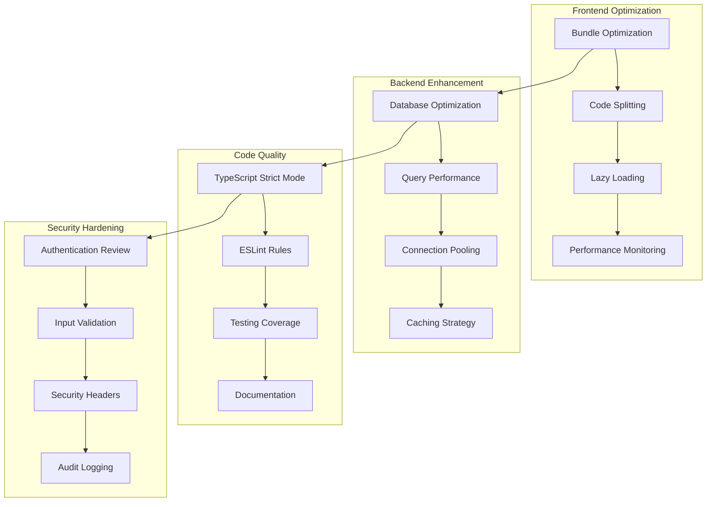
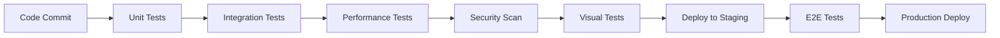
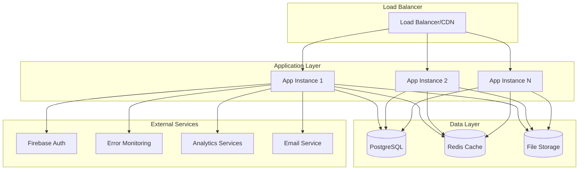

# Design Document

## Overview

This design document outlines a comprehensive codebase optimization strategy for AIGlossaryPro, targeting performance, maintainability, security, and developer experience improvements. The approach focuses on incremental enhancements that can be implemented without disrupting the existing production system.

## Strategic Context and Business Value

This section aligns the technical design with the overarching product vision and business goals, ensuring that every optimization contributes to measurable business outcomes.

### Business Objectives
- **User Acquisition:** Enhance initial user experience to improve conversion rates from visitors to registered users.
- **User Retention:** Improve application responsiveness and stability to increase user engagement and reduce churn.
- **Monetization:** Optimize performance and user experience to support premium feature adoption and conversion funnels.
- **Operational Efficiency:** Reduce technical debt and improve maintainability to lower operational costs and accelerate feature delivery.

### Key Performance Indicators (KPIs)
- **Conversion Rate:** Percentage of visitors completing key actions (e.g., sign-up, premium subscription).
- **Daily/Monthly Active Users (DAU/MAU):** Measures user engagement over time.
- **Average Session Duration:** Indicates user stickiness and content relevance.
- **Customer Lifetime Value (CLTV):** Reflects the long-term value of users.
- **Development Velocity:** Speed at which new features are delivered and bugs are resolved.

## User Experience (UX) & Design Cohesion

This section details how the design ensures a consistent, intuitive, and delightful user experience, adhering to established design principles and incorporating user feedback.

### Design Principles
- **Consistency:** Maintain a unified visual and interactive language across all components and pages.
- **Clarity:** Ensure information is presented clearly and concisely, minimizing cognitive load.
- **Efficiency:** Optimize user flows to reduce steps and time required to complete tasks.
- **Feedback:** Provide clear and immediate feedback for user actions and system states.
- **Accessibility:** Adhere to WCAG 2.1 AA standards to ensure usability for all users.

### Design System Integration
- **Component Library:** Utilize a centralized component library (e.g., Radix UI, as indicated by `package.json`) to ensure consistency and reusability.
- **Theming:** Implement a robust theming system to support light/dark modes and potential future branding changes.

### User Feedback Loop
- **Collection:** Integrate mechanisms for collecting user feedback (e.g., in-app surveys, feedback forms).
- **Analysis:** Establish a process for analyzing feedback to identify pain points and areas for improvement.
- **Iteration:** Incorporate feedback into design and development sprints for continuous UX refinement.

## Architecture

### Current State Analysis

The application currently demonstrates:
- **Strengths**: Modern React/TypeScript stack, comprehensive feature set, good documentation
- **Opportunities**: Performance optimization, code quality improvements, security hardening
- **Technical Debt**: Debug code in production, TypeScript errors, inconsistent patterns

### Target Architecture



## Market & Competitive Positioning

This section outlines how the design considerations contribute to maintaining a competitive edge and adapting to market trends.

### Competitive Analysis
- **Benchmarking:** Continuously benchmark against key competitors in terms of performance, features, and user experience.
- **Feature Differentiation:** Design features that offer unique value propositions or superior user experience compared to existing solutions.

### Market Trend Adaptation
- **Scalable Architecture:** Design for scalability and flexibility to quickly adapt to new AI/ML trends and technologies.
- **Modular Design:** Enable rapid integration of new features or third-party services to respond to market demands.
- **Data-Driven Insights:** Leverage analytics to identify emerging user needs and market opportunities.

## Operational Readiness & Post-Launch Support

This section details the design considerations for ensuring smooth operations, effective monitoring, and efficient support post-deployment.

### Supportability
- **Comprehensive Logging:** Implement detailed, contextual logging for all critical application flows to aid in debugging and issue resolution.
- **Error Reporting:** Integrate with error tracking systems (e.g., Sentry, as indicated by `package.json`) for real-time error monitoring and alerting.
- **Documentation:** Maintain up-to-date technical documentation for deployment, troubleshooting, and maintenance procedures.

### Maintainability
- **Code Standards:** Enforce strict code quality standards (e.g., ESLint, Biome, TypeScript) to ensure code readability and maintainability.
- **Automated Testing:** Implement a robust testing suite (unit, integration, E2E, visual) to prevent regressions and ensure code stability.
- **Modular Design:** Promote a modular architecture to facilitate independent development, testing, and deployment of components.

### Incident Management
- **Alerting:** Configure comprehensive alerts for performance degradation, errors, and security incidents.
- **Runbooks:** Develop clear runbooks and escalation procedures for common operational issues.
- **Rollback Strategy:** Design for quick and reliable rollback mechanisms in case of deployment failures.

## Dependencies & Risk Management

This section addresses the identification, assessment, and mitigation of project dependencies and potential risks.

### External Dependencies
- **Third-Party Services:** Document all external services (e.g., Firebase, AWS S3, Neon Database, as indicated by `package.json`) including their SLAs, potential points of failure, and fallback strategies.
- **API Integrations:** Design for resilient API integrations with proper error handling, retries, and circuit breakers.

### Technical Risks
- **Scalability Challenges:** Proactively identify and address potential scalability bottlenecks through load testing and architectural reviews.
- **Security Vulnerabilities:** Conduct regular security audits and penetration testing to identify and mitigate vulnerabilities.
- **Technical Debt:** Implement a systematic approach to track, prioritize, and resolve technical debt.

### Project Risks
- **Resource Availability:** Plan for adequate team resources and expertise for development, testing, and operations.
- **Scope Creep:** Implement strict change management processes to control scope and prevent project delays.
- **Timeline Delays:** Build in buffer time for unforeseen challenges and regularly review project progress against timelines.

## Components and Interfaces

### 1. Performance Optimization Layer

#### Bundle Analyzer Component
```typescript
interface BundleAnalyzer {
  analyzeBundle(): BundleReport;
  identifyOptimizations(): OptimizationSuggestion[];
  generateReport(): PerformanceReport;
}
```

#### Lazy Loading Manager
```typescript
interface LazyLoadingManager {
  registerComponent(name: string, loader: () => Promise<any>): void;
  preloadCritical(): Promise<void>;
  loadOnDemand(componentName: string): Promise<React.ComponentType>;
}
```

### 2. Code Quality Enhancement System

#### TypeScript Configuration Manager
```typescript
interface TypeScriptManager {
  validateConfiguration(): ValidationResult;
  enforceStrictMode(): void;
  generateTypeDefinitions(): void;
  checkCoverage(): CoverageReport;
}
```

#### Code Quality Checker
```typescript
interface CodeQualityChecker {
  runESLintAnalysis(): ESLintReport;
  checkForDebugCode(): DebugCodeReport;
  validateImports(): ImportValidationResult;
  enforceNamingConventions(): NamingReport;
}
```

### 3. Database Performance Optimizer

#### Query Analyzer
```typescript
interface QueryAnalyzer {
  analyzeSlowQueries(): SlowQueryReport[];
  suggestIndexes(): IndexSuggestion[];
  optimizeQueries(): QueryOptimization[];
  monitorPerformance(): PerformanceMetrics;
}
```

#### Connection Pool Manager
```typescript
interface ConnectionPoolManager {
  configurePool(config: PoolConfig): void;
  monitorConnections(): ConnectionStats;
  handleFailover(): void;
  optimizePoolSize(): PoolOptimization;
}
```

### 4. Security Enhancement Framework

#### Security Auditor
```typescript
interface SecurityAuditor {
  scanForVulnerabilities(): SecurityReport;
  validateAuthentication(): AuthValidationResult;
  checkSecurityHeaders(): HeaderValidationResult;
  auditPermissions(): PermissionAuditResult;
}
```

#### Input Sanitizer
```typescript
interface InputSanitizer {
  sanitizeUserInput(input: any): SanitizedInput;
  validateApiRequests(request: ApiRequest): ValidationResult;
  preventInjectionAttacks(query: string): SafeQuery;
}
```

## Data Models

### Performance Metrics Model
```typescript
interface PerformanceMetrics {
  bundleSize: number;
  loadTime: number;
  firstContentfulPaint: number;
  largestContentfulPaint: number;
  cumulativeLayoutShift: number;
  firstInputDelay: number;
  timestamp: Date;
}
```

### Code Quality Metrics Model
```typescript
interface CodeQualityMetrics {
  typeScriptErrors: number;
  eslintViolations: ESLintViolation[];
  testCoverage: number;
  duplicatedCode: number;
  complexityScore: number;
  maintainabilityIndex: number;
}
```

### Security Audit Model
```typescript
interface SecurityAuditResult {
  vulnerabilities: Vulnerability[];
  securityScore: number;
  recommendations: SecurityRecommendation[];
  complianceStatus: ComplianceStatus;
  lastAuditDate: Date;
}
```

## Error Handling

### Centralized Error Management
```typescript
class ErrorManager {
  private errorHandlers: Map<ErrorType, ErrorHandler>;
  
  handleError(error: Error, context: ErrorContext): void {
    // Log error with context
    // Notify monitoring systems
    // Provide user-friendly feedback
    // Trigger recovery mechanisms
  }
  
  registerHandler(type: ErrorType, handler: ErrorHandler): void;
  getErrorMetrics(): ErrorMetrics;
}
```

### Error Recovery Strategies
1. **Graceful Degradation**: Fallback to basic functionality when advanced features fail
2. **Retry Mechanisms**: Automatic retry for transient failures
3. **Circuit Breakers**: Prevent cascade failures in distributed components
4. **User Feedback**: Clear, actionable error messages for users

## Testing Strategy

### Multi-Layer Testing Approach

#### Unit Testing
- **Target**: 80%+ code coverage for critical paths
- **Tools**: Vitest, React Testing Library
- **Focus**: Individual component and function testing

#### Integration Testing
- **Target**: All API endpoints and database interactions
- **Tools**: Playwright, Supertest
- **Focus**: Component interaction and data flow

#### Performance Testing
- **Target**: Core Web Vitals compliance
- **Tools**: Lighthouse CI, WebPageTest
- **Focus**: Load times, bundle size, runtime performance

#### Security Testing
- **Target**: OWASP compliance
- **Tools**: ESLint security plugins, Snyk
- **Focus**: Vulnerability scanning, authentication testing

#### Visual Regression Testing
- **Target**: UI consistency across browsers/devices
- **Tools**: Playwright visual testing
- **Focus**: Layout, styling, responsive design

### Testing Automation Pipeline


## Implementation Phases

### Phase 1: Foundation (Weeks 1-2)
- TypeScript error elimination
- ESLint configuration and cleanup
- Basic performance monitoring setup
- Security audit and immediate fixes

### Phase 2: Performance (Weeks 3-4)
- Bundle optimization and code splitting
- Database query optimization
- Lazy loading implementation
- Caching strategy enhancement

### Phase 3: Quality (Weeks 5-6)
- Testing infrastructure improvement
- Code quality automation
- Documentation enhancement
- Development workflow optimization

### Phase 4: Advanced Features (Weeks 7-8)
- Advanced monitoring and analytics
- Performance budgets and alerts
- Automated security scanning
- Continuous optimization pipeline

## Monitoring and Observability

### Performance Monitoring
- Real User Monitoring (RUM) for actual user experience
- Synthetic monitoring for proactive issue detection
- Core Web Vitals tracking and alerting
- Bundle size monitoring and budgets

### Error Tracking
- Comprehensive error logging with context
- Error rate monitoring and alerting
- Performance regression detection
- User impact assessment

### Security Monitoring
- Authentication failure tracking
- Suspicious activity detection
- Vulnerability scanning automation
- Compliance monitoring

## Deployment Architecture

### Production Infrastructure Design



### Container Architecture

#### Multi-Stage Docker Build Strategy
```dockerfile
# Build stage - Development dependencies
FROM node:18-alpine AS builder
WORKDIR /app
COPY package*.json ./
RUN npm ci
COPY . .
RUN npm run build

# Production stage - Runtime only
FROM node:18-alpine AS production
WORKDIR /app
RUN addgroup -g 1001 -S nodejs
RUN adduser -S nextjs -u 1001
COPY --from=builder /app/dist ./dist
COPY --from=builder /app/node_modules ./node_modules
COPY package.json ./
USER nextjs
EXPOSE 3001
HEALTHCHECK --interval=30s --timeout=3s CMD curl -f http://localhost:3001/health
CMD ["node", "dist/index.js"]
```

### CI/CD Pipeline Architecture

```mermaid
graph LR
    A[Code Commit] --> B[GitHub Actions]
    B --> C[Build & Test]
    C --> D[Security Scan]
    D --> E[Performance Test]
    E --> F[Build Container]
    F --> G[Deploy to Staging]
    G --> H[E2E Tests]
    H --> I[Deploy to Production]
    I --> J[Health Checks]
    J --> K[Monitoring Alert]
```



### Environment Configuration Management

#### Configuration Hierarchy
```typescript
interface EnvironmentConfig {
  // Core application settings
  app: {
    nodeEnv: 'development' | 'staging' | 'production';
    port: number;
    baseUrl: string;
  };
  
  // Database configuration
  database: {
    url: string;
    ssl: boolean;
    poolSize: number;
    connectionTimeout: number;
  };
  
  // External service integrations
  services: {
    firebase: FirebaseConfig;
    email: EmailConfig;
    analytics: AnalyticsConfig;
    monitoring: MonitoringConfig;
  };
  
  // Security settings
  security: {
    jwtSecret: string;
    sessionSecret: string;
    corsOrigins: string[];
    rateLimits: RateLimitConfig;
  };
}
```

#### Secret Management Strategy
```typescript
class SecretManager {
  private secrets: Map<string, string> = new Map();
  
  async loadSecrets(): Promise<void> {
    // Load from environment variables
    // Validate required secrets exist
    // Ensure minimum security requirements
  }
  
  getSecret(key: string): string {
    const secret = this.secrets.get(key);
    if (!secret) {
      throw new Error(`Required secret ${key} not found`);
    }
    return secret;
  }
  
  validateSecrets(): ValidationResult {
    // Check secret strength
    // Verify all required secrets present
    // Validate format and constraints
  }
}
```

## Infrastructure Components

### 1. Health Check System

#### Health Check Endpoints
```typescript
interface HealthCheckSystem {
  // Basic liveness probe
  '/health': () => Promise<{ status: 'ok' | 'error', timestamp: string }>;
  
  // Readiness probe with dependencies
  '/health/ready': () => Promise<{
    status: 'ready' | 'not-ready';
    checks: {
      database: boolean;
      redis: boolean;
      externalServices: boolean;
    };
  }>;
  
  // Detailed health information
  '/health/detailed': () => Promise<{
    application: AppHealthStatus;
    dependencies: DependencyHealthStatus[];
    metrics: HealthMetrics;
  }>;
}
```

### 2. Monitoring and Observability

#### Metrics Collection
```typescript
interface MetricsCollector {
  // Application metrics
  collectAppMetrics(): AppMetrics;
  
  // Performance metrics
  collectPerformanceMetrics(): PerformanceMetrics;
  
  // Business metrics
  collectBusinessMetrics(): BusinessMetrics;
  
  // Infrastructure metrics
  collectInfraMetrics(): InfrastructureMetrics;
}
```

#### Alert Configuration
```typescript
interface AlertingSystem {
  // Critical alerts (immediate response)
  criticalAlerts: {
    applicationDown: AlertConfig;
    databaseConnectionLost: AlertConfig;
    highErrorRate: AlertConfig;
    securityBreach: AlertConfig;
  };
  
  // Warning alerts (monitoring required)
  warningAlerts: {
    highResponseTime: AlertConfig;
    lowDiskSpace: AlertConfig;
    unusualTrafficPattern: AlertConfig;
    performanceDegradation: AlertConfig;
  };
}
```

### 3. Deployment Strategies

#### Blue-Green Deployment
```typescript
interface BlueGreenDeployment {
  // Current production environment
  blueEnvironment: {
    instances: ApplicationInstance[];
    loadBalancer: LoadBalancerConfig;
    healthStatus: HealthStatus;
  };
  
  // New deployment environment
  greenEnvironment: {
    instances: ApplicationInstance[];
    loadBalancer: LoadBalancerConfig;
    healthStatus: HealthStatus;
  };
  
  // Deployment process
  deploy(): Promise<DeploymentResult>;
  rollback(): Promise<RollbackResult>;
  switchTraffic(): Promise<TrafficSwitchResult>;
}
```

#### Rolling Deployment
```typescript
interface RollingDeployment {
  // Deployment configuration
  config: {
    maxUnavailable: number;
    maxSurge: number;
    healthCheckGracePeriod: number;
    rollbackOnFailure: boolean;
  };
  
  // Deployment execution
  execute(): Promise<DeploymentResult>;
  monitor(): Promise<DeploymentStatus>;
  rollback(): Promise<RollbackResult>;
}
```

## Success Metrics

### Performance Targets
- Page load time: < 1.5 seconds
- Search response time: < 300ms
- Bundle size: < 800KB
- Lighthouse score: > 90

### Quality Targets
- TypeScript errors: 0
- Test coverage: > 80%
- ESLint violations: 0 critical
- Security vulnerabilities: 0 high/critical

### User Experience Targets
- Error rate: < 0.1%
- Availability: > 99.9%
- User satisfaction: > 4.5/5
- Performance complaints: < 1%

### Deployment Targets
- Deployment time: < 10 minutes
- Rollback time: < 5 minutes
- Zero-downtime deployments: 100%
- Failed deployment rate: < 1%

### Infrastructure Targets
- Container startup time: < 30 seconds
- Health check response: < 1 second
- Resource utilization: < 70% average
- Auto-scaling response: < 2 minutes