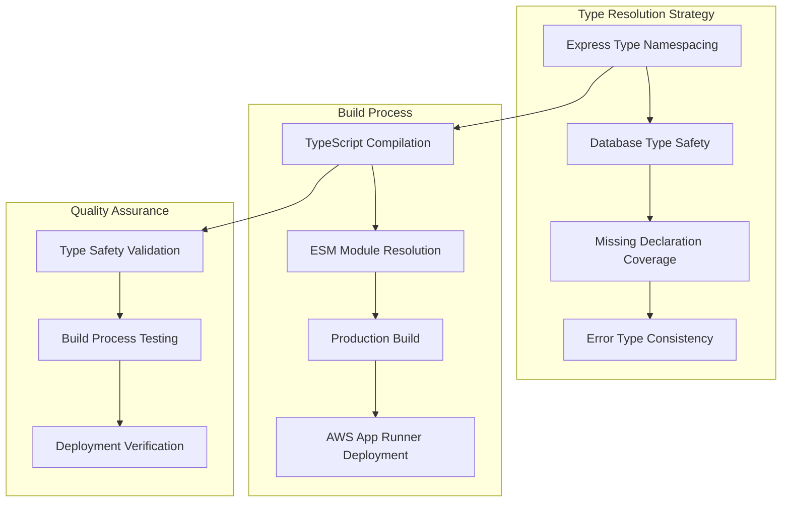

# Design Document

## Overview

This design document outlines a systematic approach to resolving TypeScript compilation errors that are blocking AWS App Runner deployment. The solution focuses on fixing type conflicts, missing declarations, and ensuring production build compatibility while maintaining code quality and type safety.

## Architecture

### Current State Analysis

The application currently faces several TypeScript compilation issues:
- **Duplicate Type Declarations**: Multiple definitions of Request/Response types causing conflicts
- **Database Query Issues**: `db()` function calls without proper type resolution
- **Missing Type Declarations**: Third-party modules lacking proper type definitions
- **Express Type Conflicts**: Middleware and route handlers with incorrect type usage
- **Error Handling Types**: Inconsistent error type definitions

### Target Architecture



## Components and Interfaces

### 1. Type Declaration Management System

#### Express Type Handler
```typescript
// Standardized Express type imports
import type { 
  Request as ExpressRequest, 
  Response as ExpressResponse,
  NextFunction 
} from 'express';

interface TypedRequest<T = any> extends ExpressRequest {
  body: T;
  user?: UserContext;
}

interface TypedResponse extends ExpressResponse {
  // Enhanced response methods with proper typing
}
```

#### Database Type Manager
```typescript
// Proper database connection typing
interface DatabaseConnection {
  query<T>(sql: string, params?: any[]): Promise<T[]>;
  transaction<T>(callback: (tx: Transaction) => Promise<T>): Promise<T>;
}

interface DatabaseManager {
  getDb(): DatabaseConnection;
  closeConnection(): Promise<void>;
  healthCheck(): Promise<boolean>;
}
```

### 2. Missing Type Declaration System

#### Module Declaration Handler
```typescript
// server/types/missing.d.ts structure
declare module 'vite' {
  // Vite-specific type declarations if needed
}

declare module 'custom-module' {
  // Custom module type declarations
}

interface GlobalTypeDeclarations {
  addDeclaration(moduleName: string, declaration: string): void;
  validateDeclarations(): ValidationResult;
}
```

### 3. Error Type Management

#### Error Handler Types
```typescript
interface ErrorContext {
  requestId: string;
  userId?: string;
  path: string;
  method: string;
  timestamp: Date;
}

interface ApplicationError {
  message: string;
  code: string;
  originalError?: Error; // Allow undefined
  context: ErrorContext;
  stack?: string;
}

interface ErrorManager {
  handleError(error: Error | ApplicationError, context: ErrorContext): void;
  createError(message: string, code: string, originalError?: Error): ApplicationError;
}
```

### 4. Build Process Integration

#### TypeScript Configuration Manager
```typescript
interface BuildConfiguration {
  validateTypes(): Promise<ValidationResult>;
  checkESMCompatibility(): Promise<CompatibilityResult>;
  generateDeclarations(): Promise<void>;
  optimizeForProduction(): Promise<void>;
}

interface DeploymentValidator {
  validateBuild(): Promise<BuildValidationResult>;
  checkNodeCompatibility(): Promise<NodeCompatibilityResult>;
  verifyESMModules(): Promise<ESMValidationResult>;
}
```

## Data Models

### Type Error Tracking Model
```typescript
interface TypeErrorReport {
  file: string;
  line: number;
  column: number;
  message: string;
  errorCode: string;
  severity: 'error' | 'warning';
  category: 'duplicate-types' | 'missing-declarations' | 'type-mismatch';
  resolution?: string;
}

interface CompilationResult {
  success: boolean;
  errors: TypeErrorReport[];
  warnings: TypeErrorReport[];
  buildTime: number;
  outputSize: number;
}
```

### Database Query Type Model
```typescript
interface QueryTypeDefinition {
  tableName: string;
  operation: 'select' | 'insert' | 'update' | 'delete';
  inputType: string;
  outputType: string;
  validation: ValidationSchema;
}

interface DatabaseTypeRegistry {
  queries: Map<string, QueryTypeDefinition>;
  tables: Map<string, TableSchema>;
  relationships: RelationshipDefinition[];
}
```

## Error Handling

### Type Error Resolution Strategy

```typescript
class TypeErrorResolver {
  private errorHandlers: Map<string, ErrorHandler>;
  
  resolveError(error: TypeErrorReport): ResolutionResult {
    const handler = this.errorHandlers.get(error.category);
    if (!handler) {
      throw new Error(`No handler for error category: ${error.category}`);
    }
    
    return handler.resolve(error);
  }
  
  registerHandler(category: string, handler: ErrorHandler): void {
    this.errorHandlers.set(category, handler);
  }
}

// Specific error handlers
class DuplicateTypeHandler implements ErrorHandler {
  resolve(error: TypeErrorReport): ResolutionResult {
    // Remove global declarations
    // Add namespaced imports
    // Update affected files
  }
}

class MissingDeclarationHandler implements ErrorHandler {
  resolve(error: TypeErrorReport): ResolutionResult {
    // Add type declarations to missing.d.ts
    // Validate module resolution
    // Update import statements
  }
}
```

### Build Process Error Recovery

```typescript
interface BuildErrorRecovery {
  // Graceful degradation for non-critical type errors
  handleNonCriticalErrors(errors: TypeErrorReport[]): void;
  
  // Automatic fixes for common patterns
  applyAutomaticFixes(errors: TypeErrorReport[]): FixResult[];
  
  // Rollback mechanism for failed fixes
  rollbackChanges(changeSet: ChangeSet): void;
}
```

## Testing Strategy

### Type Safety Testing

#### Compilation Testing
```typescript
interface CompilationTestSuite {
  // Test TypeScript compilation without errors
  testCleanCompilation(): Promise<TestResult>;
  
  // Test ESM module resolution
  testESMResolution(): Promise<TestResult>;
  
  // Test production build process
  testProductionBuild(): Promise<TestResult>;
  
  // Test AWS App Runner compatibility
  testDeploymentCompatibility(): Promise<TestResult>;
}
```

#### Type Coverage Testing
```typescript
interface TypeCoverageValidator {
  // Ensure all files have proper type coverage
  validateTypeCoverage(): Promise<CoverageReport>;
  
  // Check for any remaining @ts-nocheck comments
  checkForTypeIgnores(): Promise<IgnoreReport>;
  
  // Validate Express type usage
  validateExpressTypes(): Promise<ExpressTypeReport>;
}
```

### Integration Testing

#### Database Type Testing
```typescript
interface DatabaseTypeTests {
  // Test database query type safety
  testQueryTypes(): Promise<TestResult>;
  
  // Test connection type handling
  testConnectionTypes(): Promise<TestResult>;
  
  // Test transaction type safety
  testTransactionTypes(): Promise<TestResult>;
}
```

#### Build Process Testing
```typescript
interface BuildProcessTests {
  // Test complete build pipeline
  testFullBuild(): Promise<BuildTestResult>;
  
  // Test deployment preparation
  testDeploymentPrep(): Promise<DeploymentTestResult>;
  
  // Test rollback scenarios
  testRollbackProcess(): Promise<RollbackTestResult>;
}
```

## Implementation Phases

### Phase 1: Critical Type Fixes (Priority 1)
**Duration**: 1-2 days
**Focus**: Fix blocking compilation errors

1. **Duplicate Request/Response Types**
   - Audit all files importing Request/Response
   - Replace with namespaced Express imports
   - Remove global type declarations
   - Test compilation after each fix

2. **Database Query Type Issues**
   - Fix `db()` function calls in `server/versioningService.ts`
   - Update database connection patterns
   - Remove `@ts-nocheck` comments
   - Validate Drizzle ORM usage

### Phase 2: Missing Declarations (Priority 2)
**Duration**: 1 day
**Focus**: Complete type declaration coverage

1. **Module Declaration Updates**
   - Enhance `server/types/missing.d.ts`
   - Add Vite type declarations if needed
   - Resolve third-party module types
   - Test module resolution

2. **Error Type Consistency**
   - Fix `shared/errorManager.ts` type issues
   - Update error handling patterns
   - Ensure consistent error types
   - Test error scenarios

### Phase 3: Express Type Safety (Priority 3)
**Duration**: 1 day
**Focus**: Middleware and route type safety

1. **Middleware Type Updates**
   - Fix `server/utils/validation.ts`
   - Update all middleware files
   - Ensure proper Express type usage
   - Test request/response handling

2. **Route Handler Types**
   - Update route handler signatures
   - Fix parameter and body typing
   - Ensure response method typing
   - Test API endpoints

### Phase 4: Production Build Validation (Priority 4)
**Duration**: 1 day
**Focus**: Deployment readiness

1. **Build Process Testing**
   - Test `npm run build:server`
   - Validate ESM module compatibility
   - Ensure Node 20 compatibility
   - Test AWS App Runner deployment

2. **Quality Assurance**
   - Remove all `@ts-nocheck` comments
   - Validate type safety maintenance
   - Document type patterns
   - Create type safety guidelines

## Success Metrics

### Compilation Metrics
- **TypeScript Errors**: 0 compilation errors
- **Build Success Rate**: 100% successful builds
- **Build Time**: < 2 minutes for production build
- **Type Coverage**: > 95% type coverage

### Quality Metrics
- **@ts-nocheck Comments**: 0 remaining in production code
- **Type Safety Score**: > 90% (custom metric)
- **ESM Compatibility**: 100% module resolution
- **Node 20 Compatibility**: Full compatibility

### Deployment Metrics
- **AWS App Runner Success**: 100% deployment success rate
- **Build Process Reliability**: < 1% build failures
- **Rollback Time**: < 5 minutes if needed
- **Type Error Detection**: 100% caught in CI/CD

## Risk Mitigation

### Technical Risks

#### Type System Complexity
- **Risk**: Complex type fixes may introduce new errors
- **Mitigation**: Incremental fixes with testing after each change
- **Fallback**: Maintain backup of working state

#### Build Process Disruption
- **Risk**: Changes may break existing build process
- **Mitigation**: Test builds continuously during development
- **Fallback**: Quick rollback mechanism for failed changes

#### Deployment Compatibility
- **Risk**: Fixed types may not work with AWS App Runner
- **Mitigation**: Test deployment process in staging environment
- **Fallback**: Maintain current deployment workaround until fixes are verified

### Project Risks

#### Timeline Pressure
- **Risk**: Deployment timeline may pressure quick fixes over quality
- **Mitigation**: Focus on critical path items first, defer non-blocking issues
- **Fallback**: Prioritize deployment success over perfect type coverage

#### Scope Creep
- **Risk**: May discover additional type issues during fixes
- **Mitigation**: Maintain strict scope focus on deployment-blocking issues
- **Fallback**: Document additional issues for future resolution

## Monitoring and Validation

### Continuous Validation
```typescript
interface TypeSafetyMonitor {
  // Monitor compilation success
  monitorCompilation(): Promise<CompilationStatus>;
  
  // Track type error trends
  trackTypeErrors(): Promise<ErrorTrends>;
  
  // Validate deployment readiness
  validateDeploymentReadiness(): Promise<ReadinessStatus>;
}
```

### Quality Gates
```typescript
interface QualityGates {
  // Pre-commit type checking
  preCommitValidation(): Promise<ValidationResult>;
  
  // CI/CD type safety gates
  cicdTypeChecks(): Promise<GateResult>;
  
  // Deployment readiness checks
  deploymentGates(): Promise<DeploymentGateResult>;
}
```

This design provides a systematic approach to resolving the TypeScript compilation issues while maintaining code quality and ensuring successful AWS App Runner deployment.