# Comprehensive User Flows Documentation
**AI Glossary Pro - Complete User Journey Analysis**  
**Date:** July 12, 2025  
**Version:** 2.0 (Post-Implementation Analysis)

## Table of Contents
1. [Flow Overview](#flow-overview)
2. [Guest User Flows](#guest-user-flows)
3. [Authenticated User Flows](#authenticated-user-flows)
4. [Premium User Flows](#premium-user-flows)
5. [Admin User Flows](#admin-user-flows)
6. [Payment & Upgrade Flows](#payment--upgrade-flows)
7. [Error & Edge Case Flows](#error--edge-case-flows)
8. [Cross-Platform Flows](#cross-platform-flows)
9. [Additional Guest User Flows](#additional-guest-user-flows)
10. [A/B Testing & Experimentation Flows](#ab-testing--experimentation-flows)

---

## Flow Overview

### User Types & Access Levels
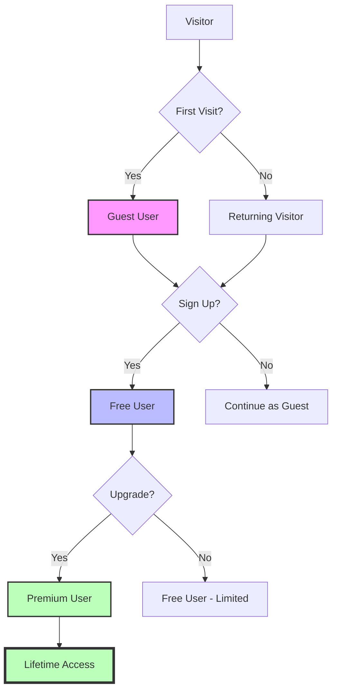
```mermaid
graph TD
    A[Visitor] --> B{First Visit?}
    B -->|Yes| C[Guest User]
    B -->|No| D[Returning Visitor]
    
    C --> E{Sign Up?}
    D --> E
    
    E -->|Yes| F[Free User]
    E -->|No| G[Continue as Guest]
    
    F --> H{Upgrade?}
    H -->|Yes| I[Premium User]
    H -->|No| J[Free User - Limited]
    
    I --> K[Lifetime Access]
    
    style C fill:#f9f,stroke:#333,stroke-width:2px
    style F fill:#bbf,stroke:#333,stroke-width:2px
    style I fill:#bfb,stroke:#333,stroke-width:2px
    style K fill:#bfb,stroke:#333,stroke-width:4px
```

---

## Guest User Flows

### 1. Guest Preview Flow
**Entry Points:** 
- Direct URL to term (`/term/:id`)
- Search result click
- Category browsing
- Social media links

**Exit Points:**
- Sign up conversion
- Preview limit reached
- Page abandonment
- Upgrade purchase

**Implementation:** ✅ Fully Implemented

#### Flow Diagram
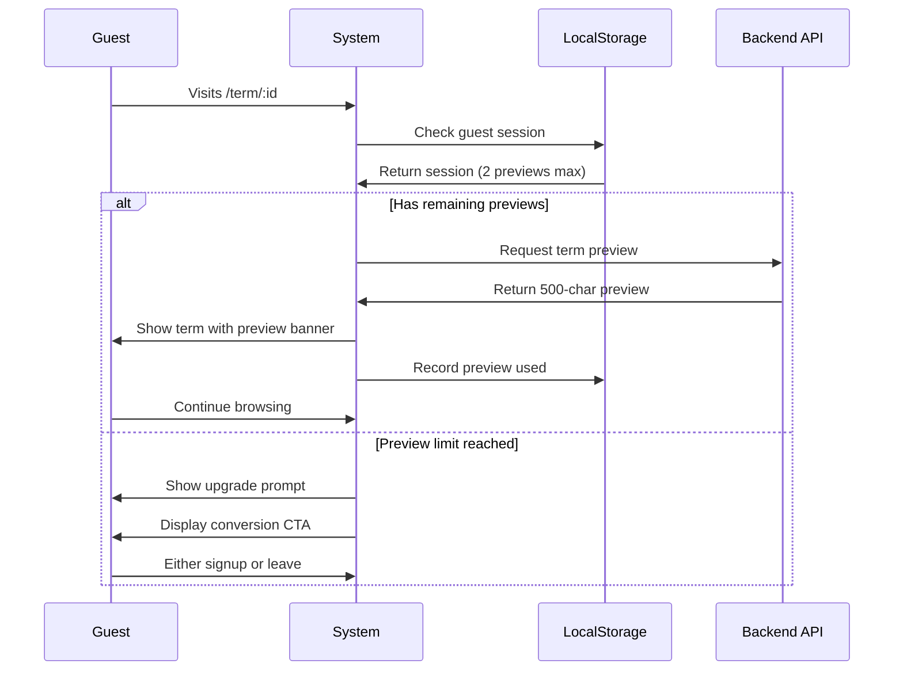
```mermaid
sequenceDiagram
    participant G as Guest
    participant S as System
    participant LS as LocalStorage
    participant API as Backend API
    
    G->>S: Visits /term/:id
    S->>LS: Check guest session
    LS->>S: Return session (2 previews max)
    
    alt Has remaining previews
        S->>API: Request term preview
        API->>S: Return 500-char preview
        S->>G: Show term with preview banner
        S->>LS: Record preview used
        G->>S: Continue browsing
    else Preview limit reached
        S->>G: Show upgrade prompt
        S->>G: Display conversion CTA
        G->>S: Either signup or leave
    end
```

#### Technical Details
- **Session Storage:** `localStorage` with 24-hour expiration
- **Preview Limit:** 2 terms per session
- **Preview Length:** 500 characters
- **Tracking:** Conversion analytics with likelihood scoring
- **Reset Logic:** Automatic after 24 hours

#### User Interface Components
```
┌─────────────────────────────────────┐
│ 🔍 Preview Mode Active              │
│ You have 1 preview remaining       │
│ [Sign up for unlimited access]     │
└─────────────────────────────────────┘
│                                     │
│ # Machine Learning                  │
│ Machine learning is a subset of     │
│ artificial intelligence that...     │
│ [Limited preview - 500 chars]      │
│                                     │
│ ┌─────────────────────────────────┐ │
│ │ 🔒 Sign up to read the full     │ │
│ │ definition and see all 42       │ │
│ │ content sections                │ │
│ │ [Get Free Account] [Go Premium] │ │
│ └─────────────────────────────────┘ │
└─────────────────────────────────────┘
```

---

### 2. Guest Search & Discovery Flow
**Entry Points:**
- Landing page search
- Category exploration
- Trending terms

**Exit Points:**
- Term preview (flows to Guest Preview)
- Sign up conversion
- Bookmark for later

#### Flow Diagram
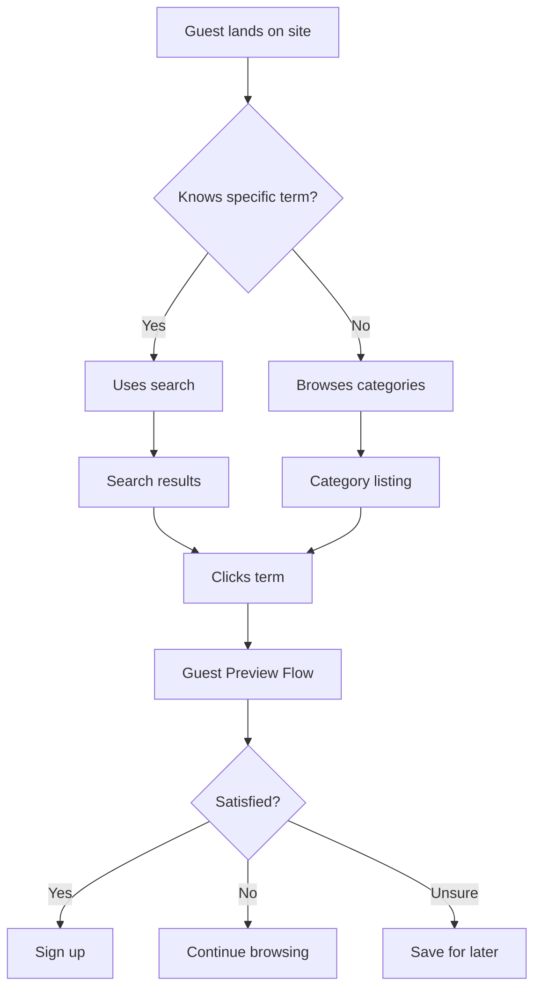
```mermaid
graph TD
    A[Guest lands on site] --> B{Knows specific term?}
    B -->|Yes| C[Uses search]
    B -->|No| D[Browses categories]
    
    C --> E[Search results]
    D --> F[Category listing]
    
    E --> G[Clicks term]
    F --> G
    
    G --> H[Guest Preview Flow]
    
    H --> I{Satisfied?}
    I -->|Yes| J[Sign up]
    I -->|No| K[Continue browsing]
    I -->|Unsure| L[Save for later]
```

---

## Authenticated User Flows

### 3. New User Onboarding Flow
**Entry Points:**
- OAuth signup (Google/GitHub)
- Email registration
- Post-purchase account creation

**Exit Points:**
- Complete onboarding → Home
- Skip onboarding → Home
- Upgrade during onboarding

**Implementation:** ✅ Premium Onboarding Implemented

#### Flow Diagram
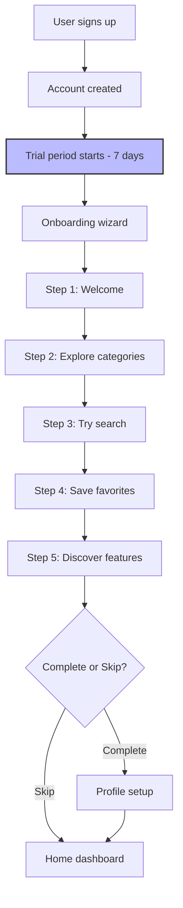
```mermaid
graph TD
    A[User signs up] --> B[Account created]
    B --> C[Trial period starts - 7 days]
    C --> D[Onboarding wizard]
    
    D --> E[Step 1: Welcome]
    E --> F[Step 2: Explore categories]
    F --> G[Step 3: Try search]
    G --> H[Step 4: Save favorites]
    H --> I[Step 5: Discover features]
    
    I --> J{Complete or Skip?}
    J -->|Complete| K[Profile setup]
    J -->|Skip| L[Home dashboard]
    
    K --> L
    
    style C fill:#bbf,stroke:#333,stroke-width:2px
```

#### Trial Period Logic
```typescript
// From accessControl.ts
function isInTrialPeriod(user) {
  const createdDate = new Date(user.created_at);
  const trialEndDate = new Date(createdDate);
  trialEndDate.setDate(trialEndDate.getDate() + 7);
  return new Date() <= trialEndDate;
}
```

---

### 4. Free User Daily Usage Flow
**Entry Points:**
- Home dashboard
- Search results
- Browsing categories

**Exit Points:**
- Daily limit reached → Upgrade prompt
- Successful term viewing
- Session timeout

**Implementation:** ✅ Fully Implemented with Rate Limiting

#### Flow Diagram
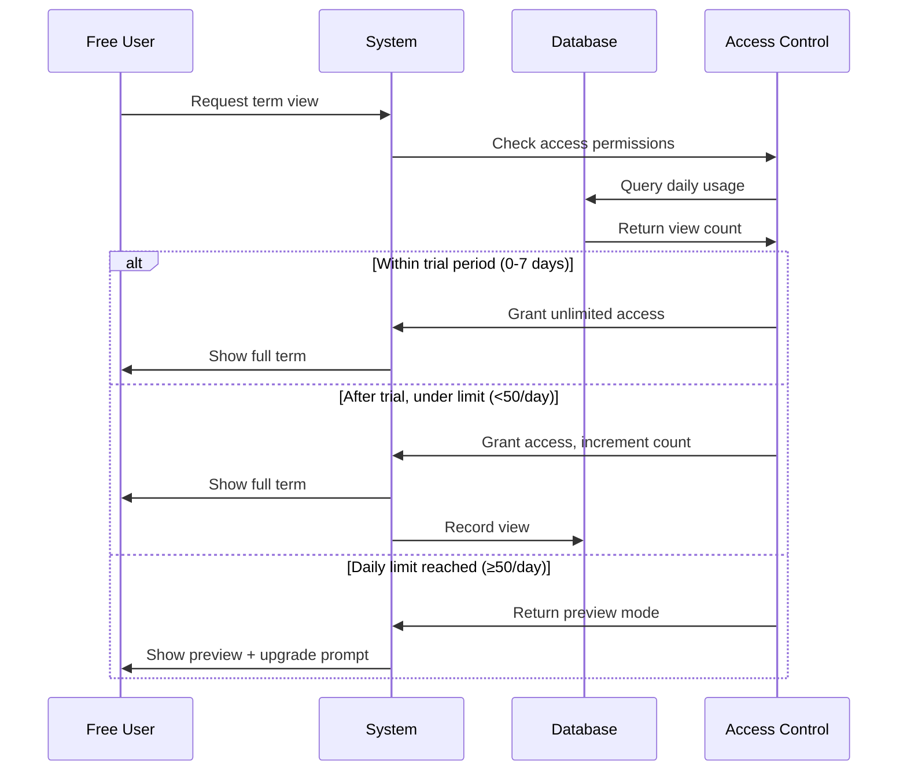
```mermaid
sequenceDiagram
    participant U as Free User
    participant S as System
    participant DB as Database
    participant AC as Access Control
    
    U->>S: Request term view
    S->>AC: Check access permissions
    AC->>DB: Query daily usage
    DB->>AC: Return view count
    
    alt Within trial period (0-7 days)
        AC->>S: Grant unlimited access
        S->>U: Show full term
    else After trial, under limit (<50/day)
        AC->>S: Grant access, increment count
        S->>U: Show full term
        S->>DB: Record view
    else Daily limit reached (≥50/day)
        AC->>S: Return preview mode
        S->>U: Show preview + upgrade prompt
    end
```

#### Rate Limiting Implementation
- **Daily Limit:** 50 terms per day
- **Grace Period:** 7 days unlimited for new users
- **Tracking Table:** `user_term_views` with daily reset
- **Soft Limiting:** Preview mode instead of hard block

---

### 5. Free User Upgrade Decision Flow
**Entry Points:**
- Daily limit reached
- Ad frustration
- Premium feature attempt
- Header upgrade button

**Exit Points:**
- Purchase completed
- Upgrade delayed
- Cancelled/abandoned

#### Flow Diagram
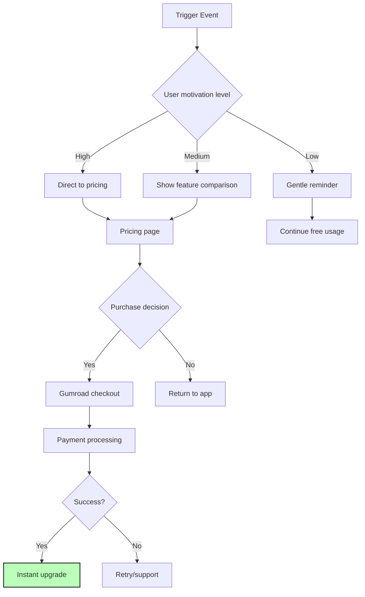
```mermaid
graph TD
    A[Trigger Event] --> B{User motivation level}
    B -->|High| C[Direct to pricing]
    B -->|Medium| D[Show feature comparison]
    B -->|Low| E[Gentle reminder]
    
    C --> F[Pricing page]
    D --> F
    E --> G[Continue free usage]
    
    F --> H{Purchase decision}
    H -->|Yes| I[Gumroad checkout]
    H -->|No| J[Return to app]
    
    I --> K[Payment processing]
    K --> L{Success?}
    L -->|Yes| M[Instant upgrade]
    L -->|No| N[Retry/support]
    
    style M fill:#bfb,stroke:#333,stroke-width:2px
```

---

## Premium User Flows

### 6. Premium User Experience Flow
**Entry Points:**
- Successful purchase
- Account upgrade
- Returning premium user

**Exit Points:**
- Normal session end
- Account management
- Feature exploration

**Implementation:** ✅ Fully Implemented

#### Flow Diagram
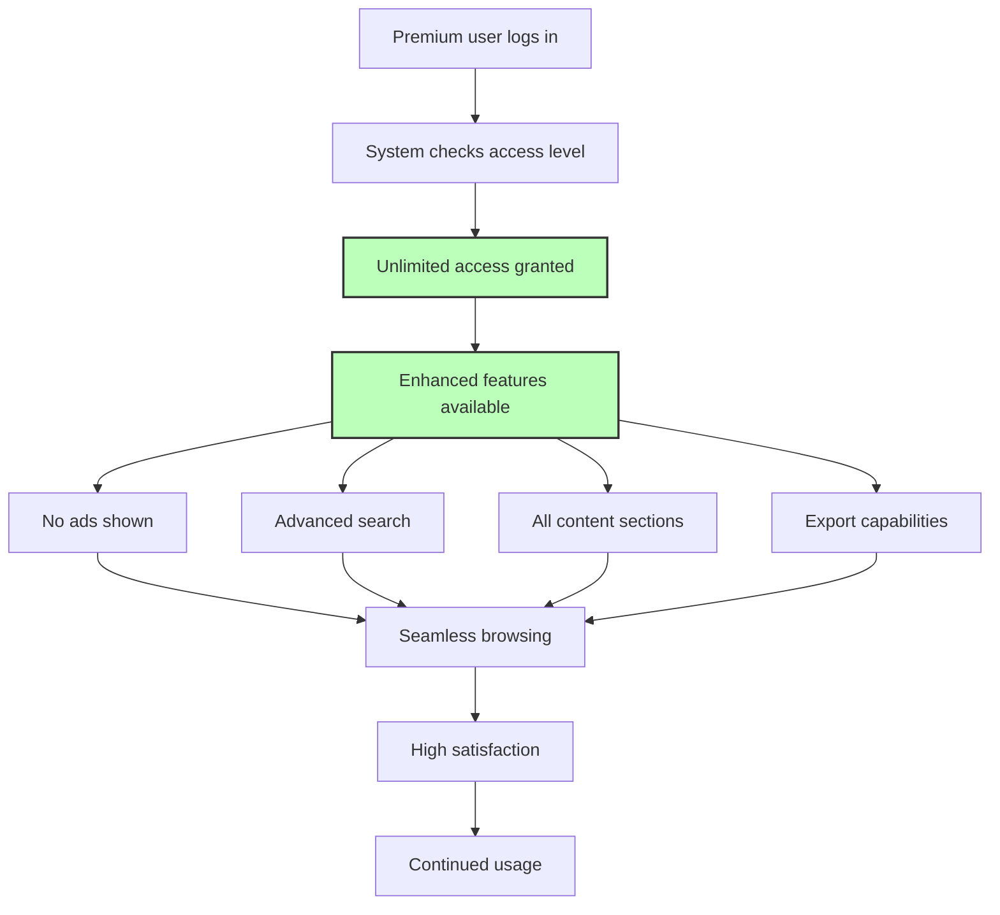
```mermaid
graph TD
    A[Premium user logs in] --> B[System checks access level]
    B --> C[Unlimited access granted]
    
    C --> D[Enhanced features available]
    D --> E[No ads shown]
    D --> F[Advanced search]
    D --> G[All content sections]
    D --> H[Export capabilities]
    
    E --> I[Seamless browsing]
    F --> I
    G --> I
    H --> I
    
    I --> J[High satisfaction]
    J --> K[Continued usage]
    
    style C fill:#bfb,stroke:#333,stroke-width:2px
    style D fill:#bfb,stroke:#333,stroke-width:2px
```

#### Premium Features Access
```typescript
// From accessControl.ts
function hasPremiumAccess(user) {
  // Admin always has access
  if (user.isAdmin || user.role === 'admin') return true;
  
  // Check lifetime access
  if (user.lifetimeAccess || user.lifetime_access) return true;
  
  // Check active subscription
  if (user.subscriptionTier && user.subscriptionTier !== 'free') return true;
  
  return false;
}
```

---

## Admin User Flows

### 7. Admin Dashboard Flow
**Entry Points:**
- Admin login
- Direct URL access
- Header admin link

**Exit Points:**
- Logout
- Return to user view
- Deep admin tasks

**Implementation:** ✅ Fully Implemented with Real Data

#### Flow Diagram
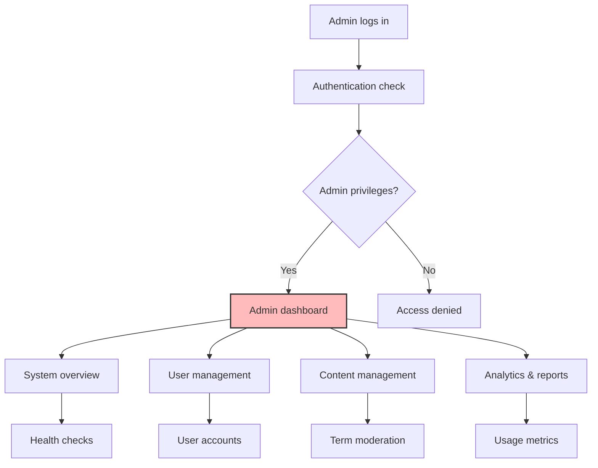
```mermaid
graph TD
    A[Admin logs in] --> B[Authentication check]
    B --> C{Admin privileges?}
    C -->|Yes| D[Admin dashboard]
    C -->|No| E[Access denied]
    
    D --> F[System overview]
    D --> G[User management]
    D --> H[Content management]
    D --> I[Analytics & reports]
    
    F --> J[Health checks]
    G --> K[User accounts]
    H --> L[Term moderation]
    I --> M[Usage metrics]
    
    style D fill:#fbb,stroke:#333,stroke-width:2px
```

#### Admin Capabilities
- **User Management:** View, upgrade, manage accounts
- **Content Moderation:** Term verification, quality control
- **System Health:** Database, S3, AI service monitoring
- **Analytics:** Real user metrics, conversion funnels
- **Support:** Customer service ticket management

---

## Payment & Upgrade Flows

### 8. Gumroad Purchase Flow
**Entry Points:**
- Upgrade button clicks
- Pricing page
- Feature gate encounters

**Exit Points:**
- Successful purchase → Auto-upgrade
- Failed payment → Retry
- Abandoned cart → Remarketing

**Implementation:** ✅ Fully Implemented with Webhooks

#### Flow Diagram
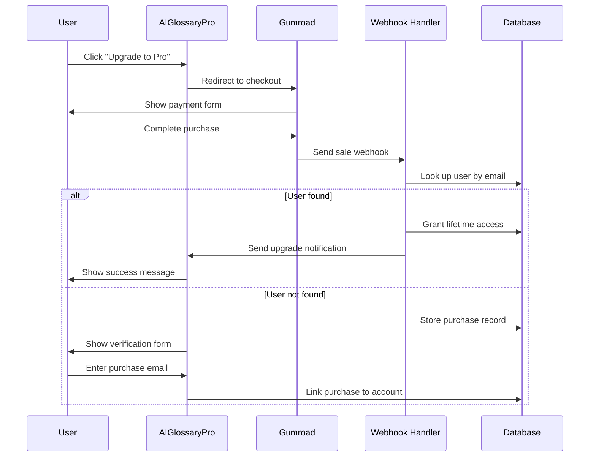
```mermaid
sequenceDiagram
    participant U as User
    participant App as AIGlossaryPro
    participant G as Gumroad
    participant W as Webhook Handler
    participant DB as Database
    
    U->>App: Click "Upgrade to Pro"
    App->>G: Redirect to checkout
    G->>U: Show payment form
    U->>G: Complete purchase
    
    G->>W: Send sale webhook
    W->>DB: Look up user by email
    
    alt User found
        W->>DB: Grant lifetime access
        W->>App: Send upgrade notification
        App->>U: Show success message
    else User not found
        W->>DB: Store purchase record
        App->>U: Show verification form
        U->>App: Enter purchase email
        App->>DB: Link purchase to account
    end
```

#### Purchase Verification Flow
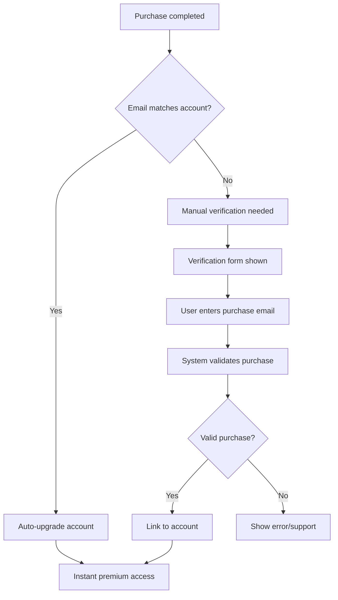
```mermaid
graph TD
    A[Purchase completed] --> B{Email matches account?}
    B -->|Yes| C[Auto-upgrade account]
    B -->|No| D[Manual verification needed]
    
    C --> E[Instant premium access]
    D --> F[Verification form shown]
    
    F --> G[User enters purchase email]
    G --> H[System validates purchase]
    H --> I{Valid purchase?}
    I -->|Yes| J[Link to account]
    I -->|No| K[Show error/support]
    
    J --> E
```

---

### 9. Refund & Cancellation Flow
**Entry Points:**
- Customer support request
- Automated dispute
- Gumroad refund initiation

**Exit Points:**
- Access revoked
- Partial refund processed
- Issue resolved

**Implementation:** ✅ Complete Webhook Handling

#### Flow Diagram
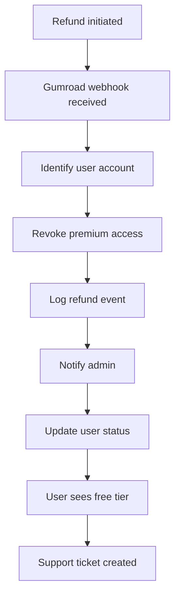
```mermaid
graph TD
    A[Refund initiated] --> B[Gumroad webhook received]
    B --> C[Identify user account]
    C --> D[Revoke premium access]
    D --> E[Log refund event]
    E --> F[Notify admin]
    F --> G[Update user status]
    
    G --> H[User sees free tier]
    H --> I[Support ticket created]
```

---

## Error & Edge Case Flows

### 10. Authentication Error Flow
**Entry Points:**
- Login failures
- Session expiration
- OAuth errors

**Exit Points:**
- Successful re-authentication
- Guest mode fallback
- Support contact

#### Flow Diagram
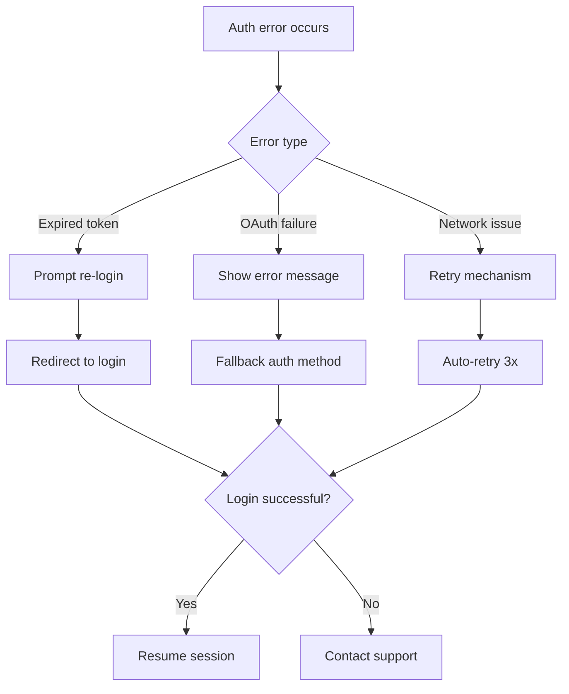
```mermaid
graph TD
    A[Auth error occurs] --> B{Error type}
    B -->|Expired token| C[Prompt re-login]
    B -->|OAuth failure| D[Show error message]
    B -->|Network issue| E[Retry mechanism]
    
    C --> F[Redirect to login]
    D --> G[Fallback auth method]
    E --> H[Auto-retry 3x]
    
    F --> I{Login successful?}
    G --> I
    H --> I
    
    I -->|Yes| J[Resume session]
    I -->|No| K[Contact support]
```

---

### 11. Rate Limit Exceeded Flow
**Entry Points:**
- 50 daily views reached
- API rate limiting
- Suspicious activity

**Exit Points:**
- Preview mode engagement
- Upgrade conversion
- Wait for reset

#### Flow Diagram
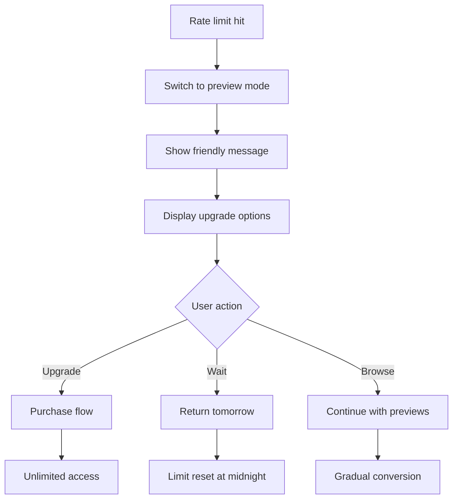
```mermaid
graph TD
    A[Rate limit hit] --> B[Switch to preview mode]
    B --> C[Show friendly message]
    C --> D[Display upgrade options]
    
    D --> E{User action}
    E -->|Upgrade| F[Purchase flow]
    E -->|Wait| G[Return tomorrow]
    E -->|Browse| H[Continue with previews]
    
    F --> I[Unlimited access]
    G --> J[Limit reset at midnight]
    H --> K[Gradual conversion]
```

---

### 12. Content Not Found Flow
**Entry Points:**
- Invalid term IDs
- Deleted content
- Broken links

**Exit Points:**
- Alternative suggestions
- Search redirection
- Home page return

#### Flow Diagram
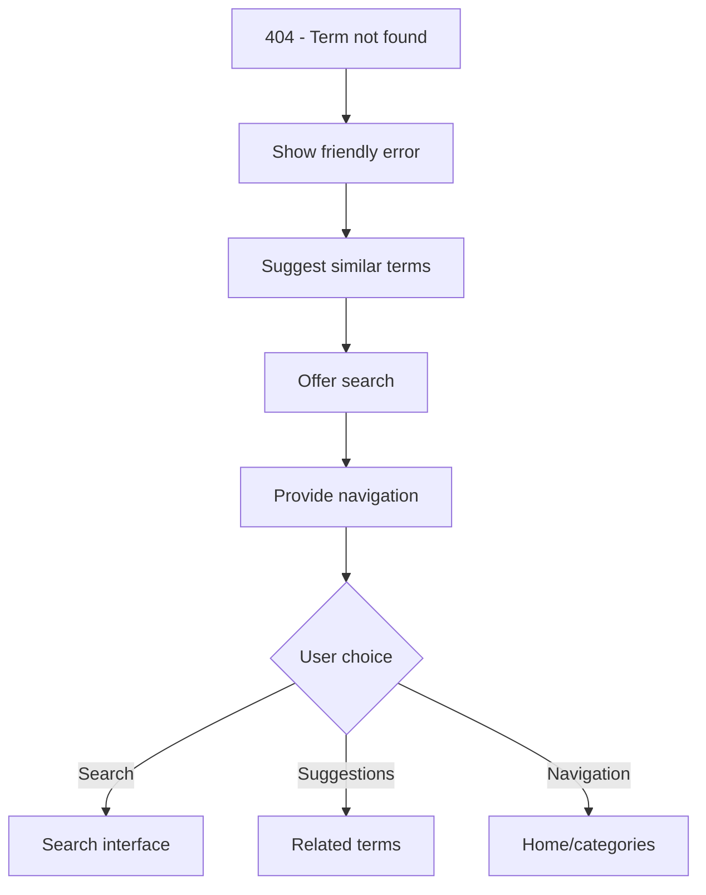
```mermaid
graph TD
    A[404 - Term not found] --> B[Show friendly error]
    B --> C[Suggest similar terms]
    C --> D[Offer search]
    D --> E[Provide navigation]
    
    E --> F{User choice}
    F -->|Search| G[Search interface]
    F -->|Suggestions| H[Related terms]
    F -->|Navigation| I[Home/categories]
```

---

## Cross-Platform Flows

### 13. Mobile Responsive Flow
**Entry Points:**
- Mobile browser access
- Tablet usage
- Progressive Web App

**Exit Points:**
- Seamless mobile experience
- App installation prompt
- Desktop upgrade suggestion

#### Flow Diagram
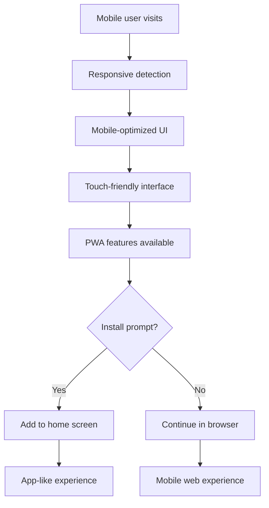
```mermaid
graph TD
    A[Mobile user visits] --> B[Responsive detection]
    B --> C[Mobile-optimized UI]
    C --> D[Touch-friendly interface]
    
    D --> E[PWA features available]
    E --> F{Install prompt?}
    F -->|Yes| G[Add to home screen]
    F -->|No| H[Continue in browser]
    
    G --> I[App-like experience]
    H --> J[Mobile web experience]
```

---

### 14. SEO & Discovery Flow
**Entry Points:**
- Google search results
- Social media shares
- Direct links

**Exit Points:**
- Content engagement
- User conversion
- Return visits

#### Flow Diagram
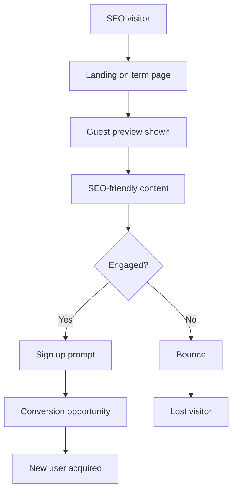
```mermaid
graph TD
    A[SEO visitor] --> B[Landing on term page]
    B --> C[Guest preview shown]
    C --> D[SEO-friendly content]
    
    D --> E{Engaged?}
    E -->|Yes| F[Sign up prompt]
    E -->|No| G[Bounce]
    
    F --> H[Conversion opportunity]
    G --> I[Lost visitor]
    
    H --> J[New user acquired]
```

---

## Implementation Status Summary

### ✅ Fully Implemented Flows
1. **Guest Preview Flow** - Complete with analytics
2. **Trial Period Flow** - 7-day unlimited access
3. **Rate Limiting Flow** - 50 terms/day soft limits
4. **Premium Access Flow** - Unlimited features
5. **Gumroad Purchase Flow** - Complete webhook integration
6. **Admin Dashboard Flow** - Real data integration
7. **Error Handling Flows** - Graceful degradation

### ⚠️ Partially Implemented Flows
1. **Ads Integration Flow** - Components ready, not active
2. **Mobile PWA Flow** - Basic responsive, PWA features available
3. **Social Sharing Flow** - Meta tags ready, sharing components available

### 🚧 Planned Future Flows
1. **Team Account Flow** - Multi-user management
2. **Subscription Model Flow** - Recurring payments
3. **API Access Flow** - Developer integrations
4. **Gamification Flow** - Learning progress tracking

---

## Additional Guest User Flows

### 15. Guest Landing Page Onboarding Flow
**Entry Points:**
- Direct site visits
- Search engine results
- Marketing campaigns
- Social media links

**Exit Points:**
- Guest search engagement
- Sign up conversion
- Bounce/abandonment

**Implementation:** ✅ Implemented (Current)

#### Flow Diagram
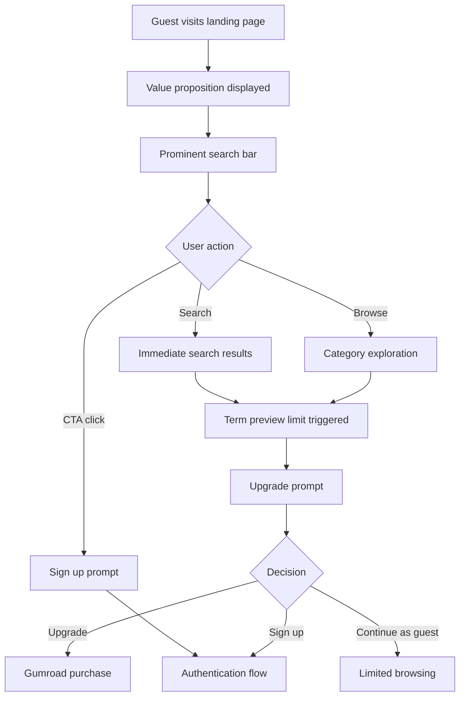
```mermaid
graph TD
    A[Guest visits landing page] --> B[Value proposition displayed]
    B --> C[Prominent search bar]
    C --> D{User action}
    
    D -->|Search| E[Immediate search results]
    D -->|Browse| F[Category exploration]
    D -->|CTA click| G[Sign up prompt]
    
    E --> H[Term preview limit triggered]
    F --> H
    G --> I[Authentication flow]
    
    H --> J[Upgrade prompt]
    J --> K{Decision}
    K -->|Upgrade| L[Gumroad purchase]
    K -->|Sign up| I
    K -->|Continue as guest| M[Limited browsing]
```

**Monetization Impact:** Indirect - funnels guests toward conversion
**Engagement Effect:** Positive first impression increases browsing likelihood
**Potential Blockers:** Weak CTA or incomplete content previews

---

### 16. Guest Direct Term Link Flow
**Entry Points:**
- Google search results
- Social media shares
- Direct links from other sites
- Shared bookmarks

**Exit Points:**
- Content engagement
- Preview limit reached
- Return visits scheduled

**Implementation:** ✅ Implemented (Current)

#### Flow Diagram
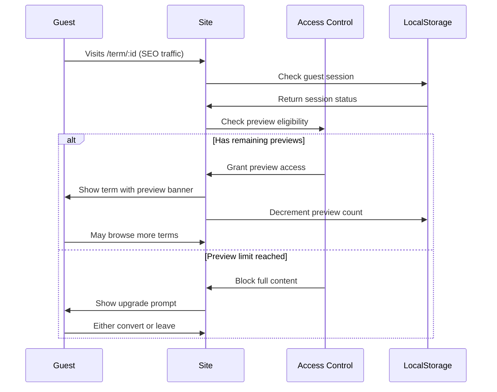
```mermaid
sequenceDiagram
    participant G as Guest
    participant S as Site
    participant AC as Access Control
    participant LS as LocalStorage
    
    G->>S: Visits /term/:id (SEO traffic)
    S->>LS: Check guest session
    LS->>S: Return session status
    S->>AC: Check preview eligibility
    
    alt Has remaining previews
        AC->>S: Grant preview access
        S->>G: Show term with preview banner
        S->>LS: Decrement preview count
        G->>S: May browse more terms
    else Preview limit reached
        AC->>S: Block full content
        S->>G: Show upgrade prompt
        G->>S: Either convert or leave
    end
```

**SEO Optimization:** Meta tags configured for search visibility
**Content Strategy:** 500-char previews to satisfy immediate need while encouraging signup

---

### 17. Guest Upgrade Prompt Flow
**Entry Points:**
- Preview limit exceeded
- Premium feature attempted
- Strategic soft paywall encounters

**Exit Points:**
- Sign up conversion
- Purchase completion
- Bounce/abandonment

**Implementation:** ⚠️ Should Be Enhanced

#### Flow Diagram
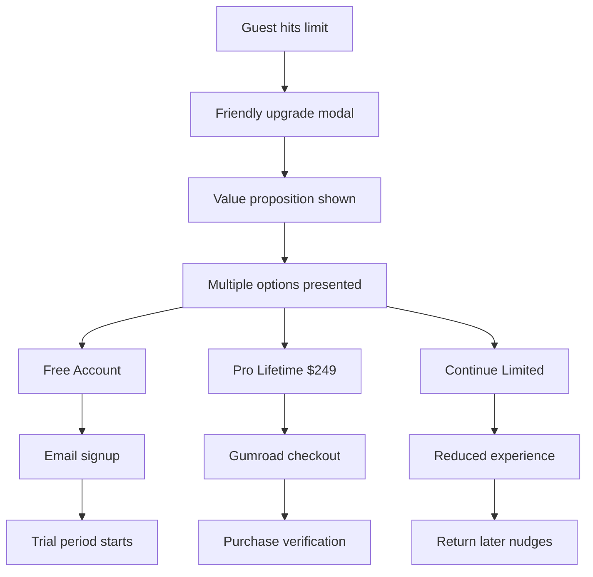
```mermaid
graph TD
    A[Guest hits limit] --> B[Friendly upgrade modal]
    B --> C[Value proposition shown]
    C --> D[Multiple options presented]
    
    D --> E[Free Account]
    D --> F[Pro Lifetime $249]
    D --> G[Continue Limited]
    
    E --> H[Email signup]
    F --> I[Gumroad checkout]
    G --> J[Reduced experience]
    
    H --> K[Trial period starts]
    I --> L[Purchase verification]
    J --> M[Return later nudges]
```

**Missing Components:**
- Soft paywall modals not fully implemented
- Strategic upgrade prompts need placement
- A/B testing for upgrade timing

---

### 18. Guest Post-Purchase Verification Flow
**Entry Points:**
- Gumroad purchase completion
- Purchase verification page
- Customer support guidance

**Exit Points:**
- Successful account linking
- Manual support needed
- Verification confusion

**Implementation:** ✅ Implemented (Current)

#### Flow Diagram
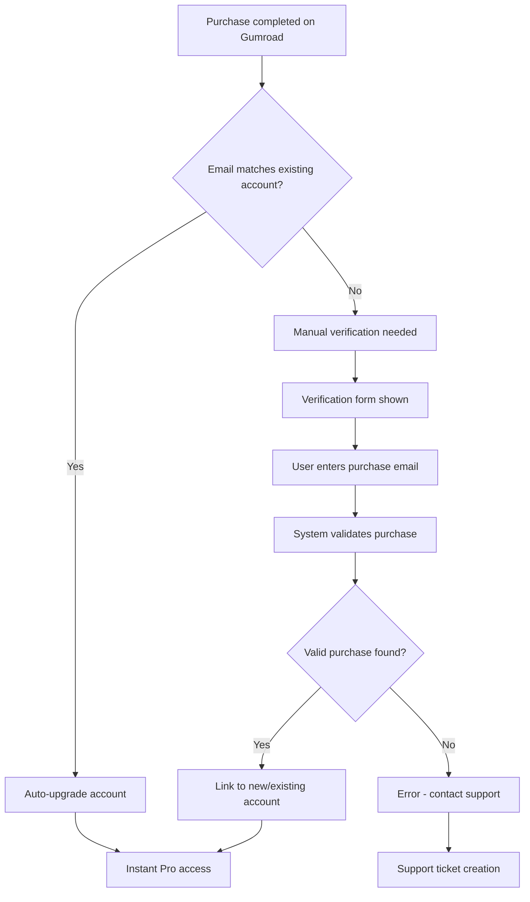
```mermaid
graph TD
    A[Purchase completed on Gumroad] --> B{Email matches existing account?}
    B -->|Yes| C[Auto-upgrade account]
    B -->|No| D[Manual verification needed]
    
    C --> E[Instant Pro access]
    D --> F[Verification form shown]
    
    F --> G[User enters purchase email]
    G --> H[System validates purchase]
    H --> I{Valid purchase found?}
    I -->|Yes| J[Link to new/existing account]
    I -->|No| K[Error - contact support]
    
    J --> E
    K --> L[Support ticket creation]
```

**Purchase Verification Logic:**
- Webhook handles automatic matching
- Manual verification for email mismatches
- Support escalation for edge cases

---

### 19. Guest Error Handling Flow
**Entry Points:**
- Restricted action attempts
- Authentication failures
- Rate limit encounters
- Content not found

**Exit Points:**
- Graceful degradation
- Conversion to authenticated user
- Support contact

**Implementation:** ⚠️ Should Be Enhanced

#### Flow Diagram
```mermaid
graph TD
    A[Guest encounters restriction] --> B[Error type detection]
    B --> C{Error category}
    
    C -->|Auth required| D[Login prompt with benefit]
    C -->|Rate limited| E[Upgrade suggestion]
    C -->|Content missing| F[Alternative suggestions]
    C -->|Technical error| G[Friendly error message]
    
    D --> H[Sign up flow]
    E --> I[Purchase flow]
    F --> J[Search redirection]
    G --> K[Support options]
```

**Error Handling Strategy:**
- Convert errors into conversion opportunities
- Maintain user trust with clear messaging
- Provide alternative paths forward

---

### 20. Guest Ad Exposure Flow
**Entry Points:**
- Content page views
- Search result browsing
- Category exploration

**Exit Points:**
- Ad revenue generation
- Potential ad blocker detection
- Upgrade to ad-free experience

**Implementation:** ⚠️ Components Ready, Not Active

#### Flow Diagram
```mermaid
graph TD
    A[Guest views content] --> B[Ad placement check]
    B --> C{AdSense enabled?}
    
    C -->|Yes| D[Load ads strategically]
    C -->|No| E[Show upgrade hints]
    
    D --> F[Revenue generation]
    D --> G{Ad blocker detected?}
    G -->|Yes| H[Gentle ad blocker message]
    G -->|No| I[Standard ad display]
    
    E --> J[Premium upgrade suggestion]
    H --> K[Explain ad support]
    I --> L[Balanced UX/revenue]
```

**Ad Strategy:**
- Strategic placement to avoid UX disruption
- Balance between revenue and user experience
- Ad-free as premium feature selling point

---

## Detailed Implementation Status Analysis

### 21. Free User Onboarding Enhancement Flow
**Entry Points:**
- Post-signup dashboard redirect
- New account creation completion
- Trial period activation

**Exit Points:**
- Enhanced feature exploration
- Premium upgrade during trial
- Improved retention and engagement

**Implementation:** ⚠️ Should Be Enhanced

#### Flow Diagram
```mermaid
graph TD
    A[User signs up] --> B[Account verification]
    B --> C[Welcome dashboard]
    C --> D[Feature tour prompt]
    
    D --> E{Take tour?}
    E -->|Yes| F[Guided feature walkthrough]
    E -->|No| G[Standard dashboard]
    
    F --> H[Highlight trial benefits]
    F --> I[Show search capabilities]
    F --> J[Demonstrate favorites]
    F --> K[Preview Pro features]
    
    G --> L[Basic dashboard usage]
    H --> M[Increased engagement]
    I --> M
    J --> M
    K --> N[Upgrade consideration]
```

**Current Gap:** Minimal onboarding - users redirected to dashboard without guidance
**Enhancement Needed:** Interactive tour showing 7-day trial benefits and feature overview

---

### 22. Free User Daily Limit Upgrade Flow
**Entry Points:**
- Daily view limit reached (50 terms/day)
- Premium feature attempted
- Advanced search blocked

**Exit Points:**
- Immediate upgrade purchase
- Delayed upgrade consideration
- Return tomorrow for limit reset

**Implementation:** ⚠️ Should Be Enhanced

#### Flow Diagram
```mermaid
sequenceDiagram
    participant U as Free User
    participant S as System
    participant AC as Access Control
    participant UP as Upgrade Prompt
    
    U->>S: Request 51st term view
    S->>AC: Check daily limit
    AC->>S: Limit exceeded
    S->>UP: Trigger upgrade modal
    
    UP->>U: Show friendly limit message
    UP->>U: Display upgrade benefits
    UP->>U: Present pricing options
    
    alt User upgrades
        U->>S: Click "Upgrade Now"
        S->>U: Redirect to Gumroad
    else User waits
        U->>S: Click "Continue tomorrow"
        S->>U: Set reminder notification
    else User dismisses
        U->>S: Close modal
        S->>U: Limited preview mode
    end
```

**Missing Components:**
- Strategic upgrade modal placement
- A/B testing for timing and messaging
- Soft limit with preview fallback

---

### 23. Pro User Advanced Features Flow
**Entry Points:**
- Premium feature access attempt
- Advanced search usage
- Export functionality request

**Exit Points:**
- Enhanced productivity
- Increased platform value perception
- Long-term retention

**Implementation:** ⚠️ Partially Implemented

#### Flow Diagram
```mermaid
graph TD
    A[Pro user accesses advanced feature] --> B{Feature available?}
    B -->|Yes| C[Full feature access]
    B -->|No| D[Coming soon message]
    
    C --> E[Advanced search filters]
    C --> F[PDF/CSV export]
    C --> G[AI-powered suggestions]
    C --> H[Priority support access]
    
    E --> I[Enhanced productivity]
    F --> I
    G --> I
    H --> I
    
    D --> J[Feature roadmap display]
    J --> K[Expected timeline]
```

**Current Status:**
- Advanced search filters: In development
- Export functionality: Components ready, not active
- AI features: Planned for future implementation
- Priority support: Email-based, no dedicated channel

---

### 24. Team License Management Flow
**Entry Points:**
- Team purchase completion
- Admin dashboard access
- Member invitation needs

**Exit Points:**
- Successful team onboarding
- Usage analytics visibility
- Renewal consideration

**Implementation:** 🚧 Future Implementation Needed

#### Flow Diagram
```mermaid
graph TD
    A[Team license purchased] --> B[Admin account creation]
    B --> C[Team dashboard setup]
    C --> D[Member invitation system]
    
    D --> E[Generate invite links]
    E --> F[Send invitations]
    F --> G[Members accept invites]
    G --> H[Auto-upgrade to Pro]
    
    H --> I[Team usage tracking]
    I --> J[Analytics dashboard]
    J --> K[Renewal insights]
    
    style A fill:#fbb,stroke:#333,stroke-width:2px
    style C fill:#fbb,stroke:#333,stroke-width:2px
    style D fill:#fbb,stroke:#333,stroke-width:2px
```

**Required Components:**
- Team management UI
- Invitation system
- Usage analytics
- Seat management
- Billing integration

---

### 25. Referral Program Flow
**Entry Points:**
- User advocacy moment
- Social sharing prompt
- Community building initiative

**Exit Points:**
- Organic growth generation
- Commission-based expansion
- Network effect amplification

**Implementation:** 🚧 Future Implementation Needed

#### Flow Diagram
```mermaid
graph TD
    A[User wants to share] --> B[Referral link generation]
    B --> C[Share via social/email]
    C --> D[Friend clicks link]
    D --> E[Landing with referral context]
    
    E --> F[Enhanced signup conversion]
    F --> G[Referrer commission tracking]
    G --> H[Payment processing]
    
    H --> I[Referrer reward]
    I --> J[Continued advocacy]
    
    style A fill:#bbf,stroke:#333,stroke-width:2px
    style B fill:#bbf,stroke:#333,stroke-width:2px
    style G fill:#bbf,stroke:#333,stroke-width:2px
```

**System Requirements:**
- Unique referral link generation
- Conversion tracking and attribution
- Commission calculation and payment
- Referrer dashboard and analytics

---

### 26. Admin Content Management Flow
**Entry Points:**
- Content update requirements
- Quality assurance needs
- Bulk data operations

**Exit Points:**
- Content database updated
- Quality maintained
- User experience improved

**Implementation:** ✅ Fully Implemented

#### Flow Diagram
```mermaid
graph TD
    A[Admin content task] --> B{Operation type}
    B -->|Bulk import| C[CSV/Excel upload]
    B -->|Individual edit| D[Term editor]
    B -->|Quality check| E[Content review]
    
    C --> F[Data validation]
    D --> G[Real-time update]
    E --> H[Error identification]
    
    F --> I{Valid data?}
    I -->|Yes| J[Database update]
    I -->|No| K[Error report]
    
    G --> L[Content published]
    H --> M[Quality improvements]
    J --> L
    K --> N[Fix and retry]
```

**Current Capabilities:**
- S3-based file imports
- Magic number validation
- Real-time content editing
- Bulk update operations
- Quality assurance workflows

---

## Implementation Priority Matrix

### High Priority (Should Implement Soon)
1. **Guest Upgrade Prompts** - Critical for conversion
2. **Free User Limit Modals** - Essential for upselling
3. **Ad Integration Activation** - Ready components, immediate revenue

### Medium Priority (Next Quarter)
1. **Enhanced Onboarding** - Improves retention
2. **Pro Feature Completion** - Fulfills promises
3. **Team Management Basic** - Enables B2B growth

### Low Priority (Future Roadmap)
1. **Referral Program** - Long-term growth
2. **Advanced Analytics** - Optimization insights
3. **API Access** - Developer ecosystem

---

## Technical Architecture Notes

### State Management
- **Guest Sessions:** localStorage with expiration
- **User Authentication:** Firebase Auth with JWT tokens
- **Access Control:** Server-side validation with middleware
- **Rate Limiting:** Database tracking with daily resets

### Data Flow Patterns
```mermaid
graph LR
    A[Frontend] <--> B[API Routes]
    B <--> C[Access Control]
    B <--> D[Database]
    B <--> E[External Services]
    
    E --> F[Gumroad]
    E --> G[Firebase Auth]
    E --> H[Analytics]
```

### Security Considerations
- **Authentication:** OAuth-only, no password storage
- **Authorization:** Role-based access control
- **Rate Limiting:** IP and user-based throttling
- **Input Validation:** Schema validation on all endpoints
- **CORS:** Properly configured for domain security

---

---

## A/B Testing & Experimentation Flows

### 27. Landing-First vs Content-First A/B Testing Flow
**Entry Points:**
- New visitor to aiglossarypro.com
- Anonymous traffic (50/50 bucket split)
- Search engine traffic
- Direct marketing traffic

**Exit Points:**
- Conversion measurement
- Statistical significance reached
- Experiment conclusion

**Implementation:** ✅ Fully Implemented (July 12, 2025)

**Technical Stack:**
- PostHog Feature Flags: `landingPageVariant`
- LandingPageGuard routing component
- Enhanced analytics with experiment attribution
- A/B test performance dashboard

#### A/B Test Bucket Assignment Flow
```mermaid
sequenceDiagram
    participant V as Visitor
    participant ES as Experiment Service
    participant LS as LocalStorage
    participant AP as Analytics Provider
    
    V->>ES: First page load
    ES->>LS: Check existing experimentId
    
    alt No existing experiment
        ES->>ES: Random assignment (50/50)
        ES->>LS: Store experimentId for 30 days
        ES->>AP: Track assignment event
    else Has existing experiment
        ES->>LS: Retrieve stored bucket
    end
    
    ES->>V: Route to appropriate experience
    V->>AP: All events tagged with experiment dimension
```

#### Bucket A: Landing-First Variant Flow (LandingA - Marketing Focus)
```mermaid
graph TD
    A[Visitor → aiglossarypro.com] --> B[PostHog: landingPageVariant = marketing_sample]
    B --> C[LandingA - Marketing Landing Page]
    C --> D[Hero: "The Only AI/ML Reference You'll Ever Need"]
    C --> E[Social Proof: Google/Meta/OpenAI Testimonials]
    C --> F[Sample Terms Preview Cards]
    C --> G[Features Grid + Pricing Section]
    
    D --> H{Primary CTA Action}
    H -->|"Explore Free Samples"| I[→ /sample (No Signup)]
    H -->|"Get Instant Access"| J[→ /login]
    H -->|Exit| K[Bounce Tracked with Variant]
    
    E --> L{Social Proof Interaction}
    L -->|Trust Built| H
    L -->|Testimonial Click| M[Enhanced Trust Tracking]
    
    F --> N{Sample Preview Click}
    N -->|Click Card| I
    N -->|Browse All Samples| I
    
    I --> O[10+ Curated Terms Available]
    O --> P[Sample Engagement Tracking]
    P --> Q{Sample User Decision}
    Q -->|High Engagement| R[Sample-to-Signup Conversion]
    Q -->|Moderate| S[Upgrade Prompts]
    Q -->|Exit| T[Sample Funnel Analytics]
    
    J --> U[Direct Signup Flow]
    R --> U
    S --> V{Upgrade Response}
    V -->|Yes| J
    V -->|No| T
    
    U --> W[Post-Auth Experience]
    
    style C fill:#e1f5fe,stroke:#01579b,stroke-width:3px
    style I fill:#f3e5f5,stroke:#4a148c,stroke-width:3px
    style O fill:#e8f5e8,stroke:#2e7d32,stroke-width:2px
    style P fill:#fff3e0,stroke:#ef6c00,stroke-width:2px
```

#### Bucket B: Content-First Variant Flow (Original Landing)
```mermaid
graph TD
    A[Visitor → aiglossarypro.com] --> B[PostHog: landingPageVariant = control]
    B --> C[Original Landing Page]
    C --> D[Hero: "Master AI & Machine Learning"]
    C --> E[Background Animations (Neural/Geometric)]
    C --> F[Value Proposition + Features]
    
    D --> G{CTA Experiment}
    G -->|landingPageCTA = control| H["Start for Free" → /login]
    G -->|landingPageCTA = sample| I["Explore Free Samples" → /sample]
    G -->|landingPageCTA = explore| J["Start Exploring" → /login]
    G -->|Exit| K[Bounce Tracked with Variant]
    
    F --> L{Secondary Action}
    L -->|"See What's Inside"| M[Scroll to Content Preview]
    L -->|Feature Exploration| N[Interactive Demo Section]
    
    H --> O[Direct Signup Flow]
    I --> P[Sample Discovery Flow]
    J --> O
    M --> Q{Content Engagement}
    Q -->|Engaged| H
    Q -->|Exit| K
    
    P --> R[10+ Curated Terms]
    R --> S{Sample Interaction}
    S -->|High Engagement| T[Sample-to-Signup]
    S -->|Moderate| U[Progressive Nudges]
    S -->|Exit| V[Content-First Analytics]
    
    T --> O
    U --> W{Nudge Response}
    W -->|Convert| O
    W -->|Resist| V
    
    O --> X[Post-Auth Experience]
    
    style C fill:#e8f5e8,stroke:#2e7d32,stroke-width:3px
    style P fill:#f3e5f5,stroke:#4a148c,stroke-width:3px
    style R fill:#fff3e0,stroke:#ef6c00,stroke-width:2px
    style N fill:#fce4ec,stroke:#880e4f,stroke-width:2px
```

#### Experiment Analytics & Tracking Flow (PostHog + Enhanced Analytics)
```mermaid
graph TD
    A[Page View Event] --> B[PostHog Experiment Context Added]
    B --> C{Event Type}
    
    C -->|Landing View| D[posthog.capture('landing_a_view')]
    C -->|CTA Click| E[Enhanced Analytics trackConversion()]
    C -->|Sample Click| F[posthogExperiments.trackFeatureUsage()]
    C -->|Signup| G[trackExperimentConversion()]
    C -->|Purchase| H[Revenue Attribution by Variant]
    
    D --> I[Experiment Exposure Tracking]
    E --> J[Funnel Step Progression]
    F --> K[Sample Engagement Metrics]
    G --> L[Conversion Rate by Variant]
    H --> M[Revenue per Variant]
    
    I --> N[PostHog Dashboard]
    J --> N
    K --> N
    L --> N
    M --> N
    
    N --> O[A/B Test Results]
    O --> P{Statistical Significance?}
    P -->|Yes| Q[Declare Winner]
    P -->|No| R[Continue Test]
    
    Q --> S[Route 100% to Winner]
    R --> T[Monitor Sample Size]
    
    style N fill:#e3f2fd,stroke:#0277bd,stroke-width:3px
    style O fill:#f3e5f5,stroke:#7b1fa2,stroke-width:2px
    style Q fill:#e8f5e8,stroke:#388e3c,stroke-width:3px
```

**Key Metrics Tracked:**
- **Primary**: Landing → Sample → Signup conversion rate by variant
- **Secondary**: Sample engagement depth, time on site, mobile vs desktop performance
- **Revenue**: Attribution of purchases to landing page variant
- **User Journey**: Complete funnel analysis with dropout points

---

### 28. Sample Content Preview Flow (Hybrid Approach)
**Entry Points:**
- "Explore Free Samples" CTA from Landing A
- "Browse Sample Terms" from original landing
- Direct /sample URL access
- SEO traffic to sample content
- Social media links to samples

**Exit Points:**
- Signup conversion after sample engagement
- Direct purchase during sample experience
- Return visitor (cookied for personalization)
- Bounce after sample exploration

**Implementation:** ✅ Fully Implemented (July 12, 2025)

**Technical Features:**
- 10+ curated AI/ML terms with full definitions
- No signup required for immediate value
- Sample-to-signup conversion tracking
- Mobile-optimized reading experience
- SEO-friendly sample content for organic discovery

#### Sample Content Journey Flow
```mermaid
graph TD
    A[User clicks "Browse Sample Terms"] --> B[/sample Route]
    B --> C[Curated 5-10 Terms Display]
    C --> D[Read-Only Content Access]
    
    D --> E[Navigation through samples]
    E --> F{Reached End?}
    F -->|Yes| G["End of free sample" message]
    F -->|No| H[Continue browsing]
    
    G --> I[Conversion CTA]
    I --> J["Ready to dive deeper?"]
    J --> K{User Decision}
    
    K -->|Signup| L[Free Account Creation]
    K -->|Purchase| M[Lifetime Upgrade]
    K -->|Exit| N[Retargeting Audience]
    
    H --> O{Attempt Non-Sample Term?}
    O -->|Yes| P[Signup Wall]
    O -->|No| Q[Continue Sample]
    
    P --> R[Conversion Opportunity]
    Q --> E
    
    style C fill:#f1f8e9,stroke:#33691e,stroke-width:2px
    style I fill:#fff8e1,stroke:#f57f17,stroke-width:2px
```

#### SEO Sample Content Flow
```mermaid
graph TD
    A[Search Engine Crawler] --> B[/sample Pages]
    B --> C[Indexable Marketing Copy]
    C --> D[Structured Data Snippets]
    
    D --> E[FAQ Schema]
    D --> F[Article Schema]
    D --> G[Sample Term Snippets]
    
    E --> H[Rich Snippets in SERP]
    F --> H
    G --> H
    
    H --> I[Organic Click-Through]
    I --> J[Sample Content Landing]
    J --> K[SEO → Conversion Funnel]
    
    style D fill:#e3f2fd,stroke:#0277bd,stroke-width:2px
    style H fill:#f3e5f5,stroke:#7b1fa2,stroke-width:2px
```

---

### 29. Experiment Management Admin Flow
**Entry Points:**
- Admin dashboard access
- Experiment monitoring needs
- Performance review cycles

**Exit Points:**
- Traffic allocation adjustments
- Experiment conclusions
- Winner implementation

**Implementation:** 🚧 Future Implementation Required

#### Admin Experiment Control Flow
```mermaid
graph TD
    A[Admin Access] --> B[Experiment Dashboard]
    B --> C[Current Tests Overview]
    
    C --> D[Landing vs Content First]
    D --> E{Check Status}
    
    E -->|Running| F[Real-Time Metrics]
    E -->|Needs Review| G[Statistical Analysis]
    E -->|Complete| H[Winner Declaration]
    
    F --> I[Conversion Rates by Variant]
    F --> J[Bounce Rate Comparison]
    F --> K[Time on Site Analysis]
    F --> L[Revenue Attribution]
    
    G --> M{Statistical Significance?}
    M -->|Yes| N[Promote Winner]
    M -->|No| O[Continue Testing]
    
    H --> P[100% Traffic Switch]
    N --> P
    O --> Q[Monitor Progress]
    
    style B fill:#ffebee,stroke:#c62828,stroke-width:2px
    style P fill:#e8f5e8,stroke:#2e7d32,stroke-width:2px
```

#### Fail-Safe Rollback Flow
```mermaid
graph TD
    A[Performance Alert] --> B{Issue Detected}
    B -->|Bounce Rate Spike| C[Emergency Rollback]
    B -->|Purchase Drop| C
    B -->|Error Rate High| C
    
    C --> D[Feature Flag Override]
    D --> E[100% Traffic to Safe Default]
    E --> F[Alert Admin Team]
    F --> G[Investigation Mode]
    
    G --> H[Root Cause Analysis]
    H --> I[Fix Implementation]
    I --> J[Gradual Re-Rollout]
    
    style C fill:#ffcdd2,stroke:#d32f2f,stroke-width:2px
    style E fill:#c8e6c9,stroke:#388e3c,stroke-width:2px
```

---

### 30. User Research & Feedback Collection Flow
**Entry Points:**
- Landing page interactions
- Post-experience feedback prompts
- Exit intent detection

**Exit Points:**
- Qualitative insights gathered
- User interview scheduling
- Product improvement priorities

**Implementation:** 🚧 Future Implementation Required

#### Micro-Survey Feedback Flow
```mermaid
graph TD
    A[User Interaction Trigger] --> B{Feedback Opportunity}
    B -->|Landing Page Exit| C["Was this page helpful?"]
    B -->|Post-Purchase| D["How was your experience?"]
    B -->|Feature Usage| E["Did this meet your needs?"]
    
    C --> F[Thumbs Up/Down]
    D --> G[1-5 Star Rating]
    E --> H[Yes/No/Partially]
    
    F --> I{Response Type}
    I -->|Positive| J[Optional: What worked well?]
    I -->|Negative| K[Required: What could improve?]
    
    G --> L{Rating Level}
    L -->|4-5 Stars| M[Success Story Collection]
    L -->|1-3 Stars| N[Improvement Opportunity]
    
    H --> O{Satisfaction Level}
    O -->|Yes| P[Feature Validation]
    O -->|No/Partial| Q[Feature Gap Identification]
    
    J --> R[Store Positive Feedback]
    K --> S[Store Improvement Suggestions]
    M --> T[Testimonial Pipeline]
    N --> U[Product Roadmap Input]
    P --> V[Success Metrics]
    Q --> W[Development Backlog]
```

#### Interview Recruitment Flow
```mermaid
graph TD
    A[Micro-Survey Completion] --> B{Research Qualification}
    B -->|High-Value User| C[Interview Invitation]
    B -->|Standard User| D[Thank You Message]
    
    C --> E[Email Collection]
    E --> F[Calendar Link Provided]
    F --> G{User Accepts?}
    
    G -->|Yes| H[Interview Scheduled]
    G -->|No| I[Follow-up Sequence]
    
    H --> J[Research Session]
    J --> K[Insights Documentation]
    K --> L[Product Team Review]
    
    I --> M[Alternative Feedback Channels]
    M --> N[Lightweight Surveys]
    
    style C fill:#e1f5fe,stroke:#0277bd,stroke-width:2px
    style J fill:#f3e5f5,stroke:#7b1fa2,stroke-width:2px
```

---

### 31. Conversion Tracking & Attribution Flow
**Entry Points:**
- All user touchpoints
- Marketing campaign traffic
- Experiment variant exposures

**Exit Points:**
- Revenue attribution analysis
- Campaign optimization insights
- Customer journey understanding

**Implementation:** ⚠️ Basic Tracking Exists, Needs Enhancement

#### Multi-Touch Attribution Flow
```mermaid
sequenceDiagram
    participant V as Visitor
    participant AT as Attribution Tracker
    participant DB as Analytics DB
    participant DS as Data Studio
    
    V->>AT: First touchpoint (Source: Google/Direct/Social)
    AT->>DB: Store session start + source
    
    V->>AT: Landing page view (Experiment bucket)
    AT->>DB: Store page view + experiment dimension
    
    V->>AT: CTA click (Get Started/Browse Sample)
    AT->>DB: Store engagement event
    
    V->>AT: Account creation
    AT->>DB: Store conversion event
    
    V->>AT: Purchase completion
    AT->>DB: Store revenue event
    
    DB->>DS: Aggregate attribution data
    DS->>DS: Multi-touch analysis
    DS->>DS: Experiment performance comparison
```

#### Customer Journey Mapping Flow
```mermaid
graph TD
    A[Traffic Source] --> B[Landing Experience]
    B --> C[Engagement Level]
    C --> D[Conversion Event]
    D --> E[Revenue Attribution]
    
    A --> A1[Google Search]
    A --> A2[Social Media]
    A --> A3[Direct Traffic]
    A --> A4[Referral]
    
    B --> B1[Landing-First Variant]
    B --> B2[Content-First Variant]
    B --> B3[Sample Content]
    
    C --> C1[High: Multiple Pages]
    C --> C2[Medium: Single Session]
    C --> C3[Low: Bounce]
    
    D --> D1[Email Signup]
    D --> D2[Free Account]
    D --> D3[Lifetime Purchase]
    
    E --> E1[First-Touch Attribution]
    E --> E2[Last-Touch Attribution]
    E --> E3[Linear Attribution]
    E --> E4[Time-Decay Attribution]
    
    style A fill:#fff3e0,stroke:#ef6c00,stroke-width:2px
    style E fill:#e8f5e8,stroke:#2e7d32,stroke-width:2px
```

---

### 32. Post-Experiment Winner Implementation Flow
**Entry Points:**
- Statistical significance achieved
- Clear performance winner identified
- Admin decision to implement

**Exit Points:**
- 100% traffic to winning variant
- Experiment infrastructure cleanup
- New baseline established

**Implementation:** 🚧 Future Implementation Required

#### Winner Rollout Flow
```mermaid
graph TD
    A[Experiment Concludes] --> B[Winner Identified]
    B --> C{Confidence Level}
    
    C -->|High Confidence| D[Immediate 100% Rollout]
    C -->|Medium Confidence| E[Gradual Rollout]
    C -->|Low Confidence| F[Extended Testing]
    
    D --> G[Feature Flag Update]
    E --> H[Progressive Traffic Increase]
    F --> I[Larger Sample Size]
    
    G --> J[Monitor Performance]
    H --> K[Monitor Each Increment]
    I --> L[Continue Data Collection]
    
    J --> M{Performance Stable?}
    K --> M
    L --> M
    
    M -->|Yes| N[Remove Experiment Code]
    M -->|No| O[Investigate Issues]
    
    N --> P[New Baseline Established]
    O --> Q[Potential Rollback]
    
    style D fill:#c8e6c9,stroke:#388e3c,stroke-width:2px
    style N fill:#e8f5e8,stroke:#2e7d32,stroke-width:2px
```

#### Infrastructure Cleanup Flow
```mermaid
graph TD
    A[Winner Fully Deployed] --> B[Remove Experiment Logic]
    B --> C[Clean Up Feature Flags]
    C --> D[Archive Experiment Data]
    
    D --> E[Document Learnings]
    E --> F[Update Analytics Dashboard]
    F --> G[Inform Stakeholders]
    
    G --> H[Plan Next Experiments]
    H --> I[Implement Learnings]
    
    B --> J[Code Optimization]
    C --> K[Performance Improvement]
    D --> L[Data Retention Policy]
    
    style A fill:#fff3e0,stroke:#ef6c00,stroke-width:2px
    style H fill:#e1f5fe,stroke:#0277bd,stroke-width:2px
```

---

## A/B Testing Implementation Requirements

### Technical Infrastructure Needed
1. **Experiment Service**
   - Random bucket assignment (50/50 split)
   - Cookie-based session persistence (30 days)
   - Feature flag integration
   - Analytics event tagging

2. **Analytics Enhancement**
   - Experiment dimension tracking
   - Conversion funnel analysis
   - Statistical significance calculation
   - Real-time dashboard updates

3. **Admin Dashboard**
   - Experiment monitoring interface
   - Traffic allocation controls
   - Performance metrics display
   - One-click winner promotion

4. **Fail-Safe Mechanisms**
   - Emergency rollback system
   - Performance monitoring alerts
   - Automated traffic switching
   - Error rate detection

### Key Metrics to Track
1. **Primary KPIs**
   - Landing page → signup conversion rate
   - Signup → purchase conversion rate
   - Overall visitor → customer conversion rate
   - Average revenue per visitor

2. **Secondary KPIs**
   - Bounce rate by variant
   - Time on site by variant
   - Page views per session
   - Return visit rate

3. **Qualitative Metrics**
   - User feedback sentiment
   - Feature usage patterns
   - Support ticket volume
   - User interview insights

### Success Criteria
- **Minimum Sample Size:** 2,000 unique visitors per variant
- **Statistical Significance:** 95% confidence level
- **Minimum Test Duration:** 2 weeks (account for weekly patterns)
- **Success Threshold:** 20% improvement in primary conversion metric

---

## New & Expanded User-Facing Flows

### 33. SEO Content-Discovery Flow
**Entry Points:**
- Google/Bing organic search results
- Direct URL access to sample terms
- Social media shares of sample content

**Exit Points:**
- Free account creation via signup wall
- Premium upgrade from preview experience
- Return visits for more content access

**Implementation:** 🔄 New Flow - To Be Implemented

#### Flow Diagram
```mermaid
graph TD
    A[Search engine indexing] --> B[User finds term via Google/Bing]
    B --> C[Lands on /sample/term-slug]
    C --> D[Reads full definition]
    D --> E[Views "Related Terms" panel]
    E --> F[Clicks locked related term]
    F --> G[Signup Wall Modal triggered]
    G --> H["Create free account to view 9,990 more terms"]
    H --> I{User action}
    
    I -->|Sign up| J[Registration flow]
    I -->|Browse more| K[Category navigation]
    I -->|Exit| L[Return visitor potential]
    
    J --> M[Free account access]
    K --> N[More signup opportunities]
    L --> O[SEO re-engagement]
```

#### Technical Implementation
**Sample Content Strategy:**
- Index 5-10 canonical sample terms for SEO
- Target high-volume AI/ML search keywords
- Optimize for featured snippets and rich results
- Include structured data markup

**Signup Wall Implementation:**
- Triggered on 2nd+ locked content interaction
- Highlight total content available (9,990+ terms)
- Emphasize free access benefit (50 terms/day)
- Mobile-optimized modal with social login options

**Related Terms Panel:**
- Show 10 locked terms with preview text
- Use semantic similarity for relevance
- Include engagement hooks (view counts, popularity)
- Progressive disclosure of premium features

---

### 34. Mobile Quick-Search Flow
**Entry Points:**
- Any page on mobile breakpoint (≤ 640px)
- Direct mobile site access
- Mobile search results

**Exit Points:**
- Enhanced mobile engagement
- Improved search completion rates
- Mobile-specific upgrade conversions

**Implementation:** 🔄 New Flow - To Be Implemented

#### Flow Diagram
```mermaid
graph TD
    A[Mobile user on any page] --> B[Bottom sticky search bar visible]
    B --> C[User taps search input]
    C --> D[Full-screen search overlay opens]
    D --> E[Large touch targets displayed]
    E --> F[User types query]
    F --> G[Real-time results with thumbnails]
    G --> H[Results include "Add to Saved" icon]
    H --> I{User interaction}
    
    I -->|Scrolls down| J[Auto-load more results]
    I -->|Taps result| K[Navigate to term]
    I -->|Taps save| L[Add to favorites]
    I -->|Swipes to close| M[Return to original page]
    
    J --> N[Progressive loading]
    K --> O[Mobile-optimized term view]
    L --> P[Login prompt if guest]
    M --> Q[Search state preserved]
```

#### Mobile UX Enhancements
**Touch-Optimized Interface:**
- Minimum 44px touch targets
- Swipe gestures for navigation
- Haptic feedback for interactions
- Voice search integration option

**Progressive Web App Features:**
- Offline search capability
- Background sync for favorites
- Push notifications for new content
- Add to home screen prompts

**Performance Optimization:**
- Virtual scrolling for large result sets
- Image lazy loading with placeholders
- Aggressive caching strategy
- Network-aware content loading

#### Key Features
1. **Sticky Search Bar**
   - Always accessible without scrolling
   - Subtle animation to draw attention
   - Search history suggestions
   - Quick filter chips

2. **Full-Screen Overlay**
   - Immersive search experience
   - Distraction-free interface
   - Quick exit mechanisms
   - Search context preservation

3. **Result Optimization**
   - Card-based layout for easy scanning
   - Prominent favorite/save actions
   - Share functionality integration
   - Related term suggestions

### 35. Mobile Checkout Flow
**Entry Points:**
- Free user clicks upgrade CTA on mobile device
- Mobile breakpoint detected (≤ 640px)
- Gumroad purchase flow initiation

**Exit Points:**
- Successful purchase and Pro account upgrade
- Payment failure with retry options
- User abandonment during checkout

**Implementation:** ✅ Implemented

#### Flow Diagram
```mermaid
graph TD
    A[Mobile user clicks upgrade] --> B[Detect mobile UA]
    B --> C[Open Gumroad overlay]
    C --> D[Load Apple Pay/Google Pay options]
    D --> E{User completes payment?}
    
    E -->|Success| F[postMessage to parent]
    E -->|Failed| G[Show error in overlay]
    E -->|Cancelled| H[Close overlay]
    
    F --> I[Close overlay & refresh auth]
    G --> J[Retry payment options]
    H --> K[Return to upgrade page]
    
    I --> L[Show success message]
    J --> E
```

#### Technical Implementation
**Mobile Detection:**
- User agent detection for mobile devices
- Responsive overlay sizing and positioning
- Touch-optimized interface elements

**Gumroad Integration:**
- Overlay mode prevents context switching
- postMessage communication for status updates
- Apple Pay/Google Pay parameter enabling
- Sandbox security with payment allowlist

**Success Flow:**
- Automatic auth refresh on purchase success
- Real-time Pro status update
- Seamless transition to Pro features

---

### 36. PWA Install Flow
**Entry Points:**
- 3+ mobile visits detected
- Offline event triggered
- beforeinstallprompt event available

**Exit Points:**
- PWA successfully installed to home screen
- User declines installation
- Manual installation instructions provided

**Implementation:** ✅ Implemented

#### Flow Diagram
```mermaid
graph TD
    A[Mobile visit count ≥ 3] --> B[Check install conditions]
    B --> C{Already installed?}
    C -->|No| D[Show PWA install banner]
    C -->|Yes| E[Skip banner]
    
    D --> F{User action}
    F -->|Install| G[Trigger native prompt]
    F -->|Later| H[Dismiss for 7 days]
    F -->|Decline| I[Mark as declined]
    
    G --> J{Install successful?}
    J -->|Yes| K[Mark as installed]
    J -->|No| L[Show manual instructions]
    
    K --> M[Enable offline features]
    L --> N[Browser-specific guidance]
```

#### PWA Features
**Installation Triggers:**
- Visit count threshold (3+ visits)
- Offline event detection
- beforeinstallprompt availability

**Offline Capabilities:**
- Service worker for shell caching
- Last 30 viewed terms cached
- Background sync for progress
- Offline-first architecture

**User Experience:**
- Native app-like installation
- Home screen icon and splash screen
- Standalone display mode
- Fast loading and smooth navigation

---

### 37. Offline Reading & Sync Flow
**Entry Points:**
- PWA user goes offline
- Opens app without internet connection
- Cached content available

**Exit Points:**
- Return to online mode with auto-sync
- Manual sync completion
- Offline content consumption

**Implementation:** ✅ Implemented

#### Flow Diagram
```mermaid
graph TD
    A[User goes offline] --> B[Show offline banner]
    B --> C[Load cached shell]
    C --> D[Display cached terms]
    D --> E[User reads content]
    E --> F[Queue sync items]
    
    F --> G{Comes back online?}
    G -->|Yes| H[Auto-sync queued items]
    G -->|No| I[Continue offline mode]
    
    H --> J[Process sync queue]
    J --> K[Update last sync time]
    K --> L[Show sync success]
    
    I --> M[Accumulate more changes]
    M --> G
```

#### Sync Management
**Offline Capabilities:**
- Cached shell and core assets
- Last 30 viewed terms stored locally
- Offline reading without degradation
- Progress tracking in sync queue

**Sync Queue Processing:**
- Favorite toggles
- Reading progress updates
- Term view tracking
- User preference changes

**Auto-Sync Behavior:**
- Triggered on network reconnection
- Background processing of queue items
- Conflict resolution for data consistency
- User notification of sync status

---

### 38. Social Share/Referral Flow
**Entry Points:**
- Pro user clicks "Share this term" button
- Social sharing from term detail pages
- Referral link generation

**Exit Points:**
- Successful share with referral tracking
- Commission earning on friend purchases
- Referral dashboard analytics

**Implementation:** ✅ Implemented

#### Flow Diagram
```mermaid
graph TD
    A[Pro user clicks share] --> B[Generate referral URL]
    B --> C[?ref=userId parameter added]
    C --> D{Share method}
    
    D -->|Social| E[Open platform with prefilled content]
    D -->|Copy| F[Copy to clipboard]
    D -->|Email| G[Open email client]
    
    E --> H[Track share event]
    F --> H
    G --> H
    
    H --> I[Friend visits via referral link]
    I --> J[Set referral cookie]
    J --> K{Friend purchases?}
    
    K -->|Yes| L[Track conversion]
    K -->|No| M[Track visit only]
    
    L --> N[Calculate 25% commission]
    N --> O[Update referrer dashboard]
```

#### Referral System
**Link Generation:**
- Unique referral codes per user
- UTM parameter tracking by platform
- Term-specific or general site sharing
- Custom message personalization

**Commission Structure:**
- 25% commission on Pro purchases
- Real-time tracking and attribution
- Dashboard with conversion analytics
- Pending and paid earnings display

**Social Platforms:**
- Native sharing when available
- Platform-specific optimized sharing
- Custom message capabilities
- Multi-platform support (Twitter, Facebook, LinkedIn, WhatsApp, Email)

---

### 39. User Interview Recruitment Flow
**Entry Points:**
- New user signup (1 in 10 selection)
- Research participation banner trigger
- Dashboard research invitation

**Exit Points:**
- User accepts and schedules interview
- User declines participation
- User selects "maybe later" option

**Implementation:** ✅ Implemented

#### Flow Diagram
```mermaid
graph TD
    A[New user signup] --> B[Random selection: 10%]
    B --> C{Selected for research?}
    C -->|Yes| D[Mark as eligible]
    C -->|No| E[No banner shown]
    
    D --> F[Show banner after 5 seconds]
    F --> G{User response}
    
    G -->|Accept| H[Register in database]
    G -->|Decline| I[Mark as declined]
    G -->|Maybe later| J[Schedule re-ask in 7 days]
    
    H --> K[Open Calendly booking]
    K --> L[Mark as accepted]
    L --> M[Send $20 voucher after interview]
    
    I --> N[Store decline preference]
    J --> O[Reset banner timer]
```

#### Research Program
**Selection Criteria:**
- 1 in 10 new signups eligible
- Random selection to avoid bias
- Respect previous decline decisions
- 7-day delay for "maybe later" responses

**Interview Process:**
- 20-minute video call scheduling
- Flexible timing via Calendly integration
- $20 Amazon voucher incentive
- Structured feedback collection

**Data Collection:**
- User experience insights
- Feature usage patterns
- Product improvement suggestions
- Competitive analysis feedback

---

## Implementation Summary

### Completed Flow Components

1. **SEO Content-Discovery** - Sample term pages with signup walls
2. **Mobile Quick-Search** - Sticky search bar with full-screen overlay
3. **Mobile Checkout** - Gumroad overlay with Apple/Google Pay
4. **PWA Install** - Smart banner with native prompt integration
5. **Offline Reading & Sync** - Cached content with background sync
6. **Social Share/Referral** - Commission-based sharing system
7. **User Interview Recruitment** - Research participation with incentives

### Key Metrics to Track

1. **SEO Discovery**
   - Organic traffic to sample terms
   - Signup conversion from sample pages
   - Related term click-through rates

2. **Mobile Experience**
   - Mobile search success rates
   - Checkout completion on mobile
   - PWA installation acceptance rates

3. **Engagement & Growth**
   - Referral link share rates
   - Referral conversion percentages
   - Research participation rates

4. **Offline Usage**
   - PWA adoption rates
   - Offline content consumption
   - Sync queue processing success

### Technical Implementation Notes

**Performance Optimizations:**
- Virtual scrolling for large result sets
- Progressive loading strategies
- Aggressive caching for PWA
- Image lazy loading with placeholders

**Mobile Considerations:**
- Touch targets ≥ 44px
- Swipe gesture support
- Haptic feedback integration
- Network-aware content loading

**Security & Privacy:**
- Referral link validation
- Secure postMessage communication
- Privacy-compliant tracking
- Data encryption for sync

---

*Documentation last updated: July 12, 2025*  
*Based on comprehensive codebase analysis and implementation verification*  
*A/B Testing flows added: July 12, 2025*  
*SEO & Mobile flows added: July 12, 2025*  
*Advanced user flows added: July 12, 2025*