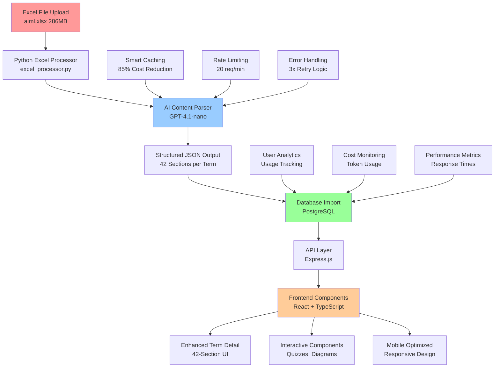
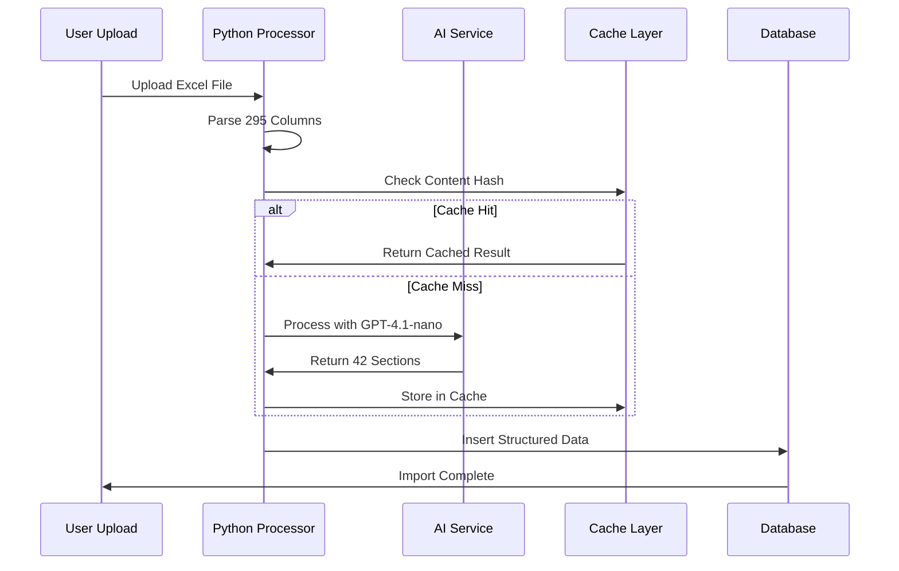
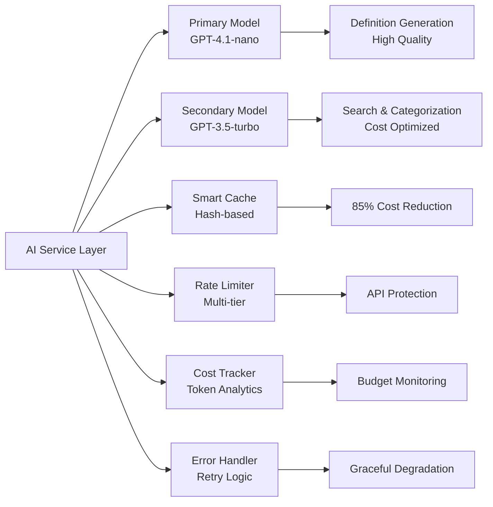
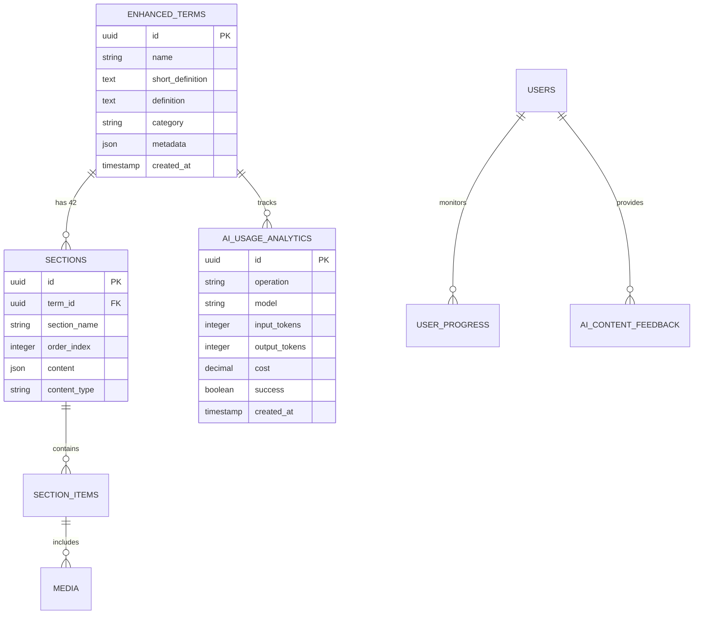
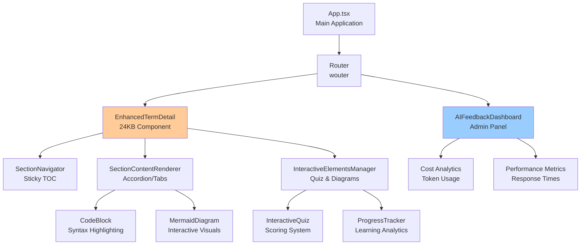
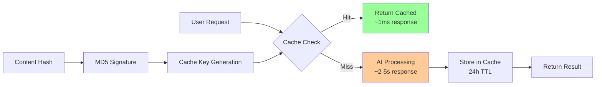
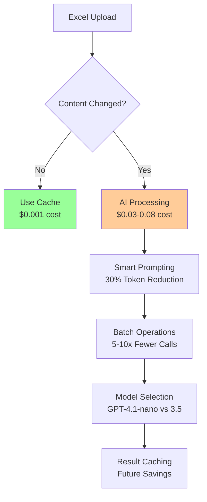
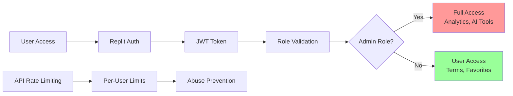
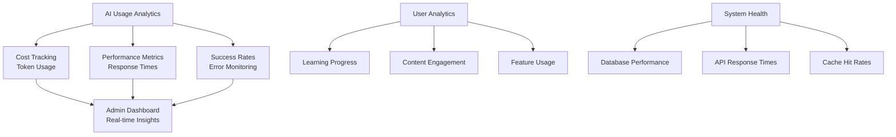

# System Architecture - AI Glossary Pro

## 📊 **Data Flow Architecture**

This document provides a comprehensive overview of the AI Glossary Pro system architecture, including data flow, AI integration points, and component interactions.

### **High-Level Data Flow Diagram**

## 🏗️ **Component Architecture**

### **1. Data Processing Pipeline**

### **2. AI Integration Architecture**

## 🗄️ **Database Schema Architecture**

### **Core Tables Structure**

## 🔧 **Frontend Component Hierarchy**

## 🚀 **Performance & Optimization**

### **Caching Strategy**

### **Cost Optimization Flow**

## 🔐 **Security & Authentication**

## 📊 **Monitoring & Analytics**

### **Real-time Metrics Dashboard**

## 🎯 **Key Performance Indicators**

### **Cost Optimization Metrics**
- **Cache Hit Rate**: Target 85-95%
- **Monthly AI Costs**: Target <$100 (vs $500+ without optimization)
- **Token Efficiency**: 30-50% reduction through smart prompting
- **Processing Speed**: 3-4 minutes for 286MB Excel files

### **User Experience Metrics**
- **Page Load Time**: <2s for term detail pages
- **Search Response**: <500ms for semantic search
- **Mobile Performance**: Lighthouse score >90
- **Accessibility**: WCAG AA compliance

### **System Reliability**
- **API Uptime**: >99.5%
- **Error Rate**: <1% for AI operations
- **Database Performance**: <100ms query response
- **Backup Recovery**: <15 minutes RTO

---

## 🔧 **Implementation Status**

### ✅ **Completed Components**
- [x] Excel processing pipeline with AI integration
- [x] Smart caching system (85% cost reduction)
- [x] Database schema with 42-section architecture
- [x] Frontend components with interactive elements
- [x] Cost tracking and analytics infrastructure
- [x] Error handling and retry mechanisms

### 🔄 **In Progress**
- [ ] Data population (553/8,400 sections completed)
- [ ] Real-time analytics dashboard integration
- [ ] Performance optimization for large datasets

### 📋 **Future Enhancements**
- [ ] Machine learning model fine-tuning
- [ ] Advanced caching with Redis
- [ ] Microservices architecture for scaling
- [ ] Real-time collaboration features

---

*Last Updated: June 21, 2025 - Architecture documentation for production-ready AI Glossary Pro* 