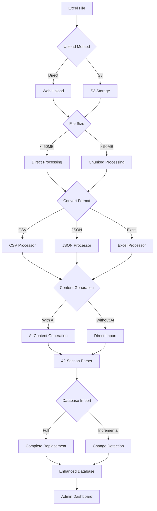
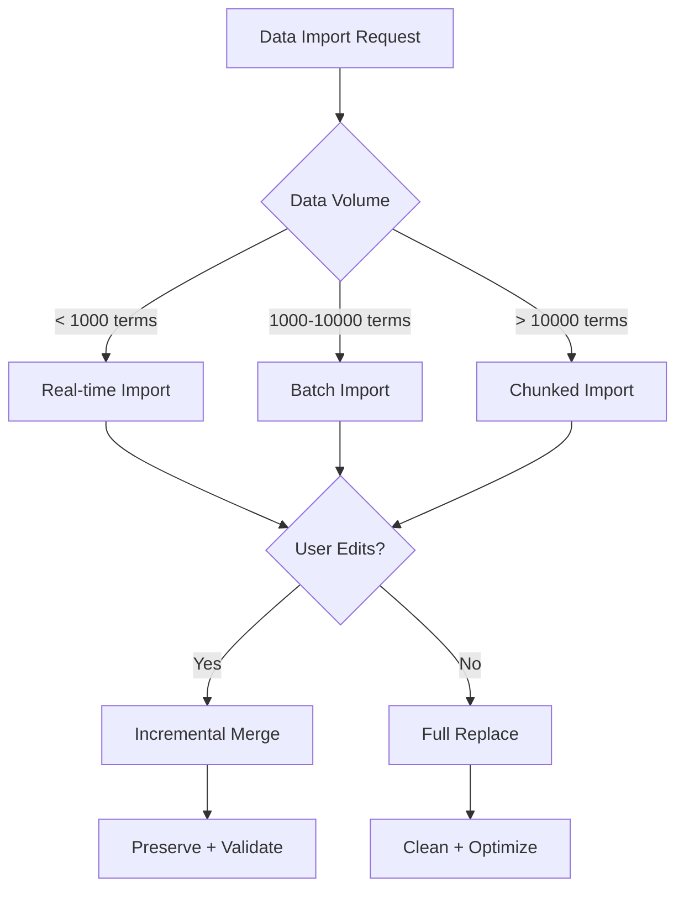

# 📋 Complete AI/ML Glossary Workflow Documentation

## 🏗️ System Architecture Overview



---

## 📁 Stage 1: Excel Upload and S3 Integration

### **Upload Methods & Script Selection**

| Upload Method | File Size Limit | Script/Service | Language | Rationale |
|---------------|-----------------|----------------|----------|-----------|
| **Direct Upload** | < 50MB | `DragDropUploader.tsx` | TypeScript | Fast, real-time feedback, no external dependencies |
| **S3 Upload** | Unlimited | `s3Service.ts` | TypeScript | Handles large files, resumable uploads, cost-effective storage |
| **S3 Existing** | N/A | `S3FileManagerDashboard.tsx` | TypeScript | Process files already in cloud storage |

### **Current Implementation Status**
```typescript
// ✅ READY: Direct Upload
/client/src/components/DragDropUploader.tsx
- Drag-drop interface with progress tracking
- File validation (type, size, format)
- Real-time upload status
- Error handling and retry logic

// ✅ READY: S3 Integration  
/server/s3Service.ts
- Multipart upload for large files
- Progress tracking and resumable uploads
- Compression and optimization
- Access control and security

// ✅ READY: S3 Management
/client/src/components/S3FileManagerDashboard.tsx
- Browse existing S3 files
- Download, delete, and process files
- Batch operations
- Storage analytics
```

### **Processing Recommendation**
- **Files < 50MB**: Use direct upload for immediate processing
- **Files > 50MB**: Use S3 upload with chunked processing
- **Batch Operations**: Use S3 for storing multiple files

---

## 🔄 Stage 2: Format Conversion (Excel → CSV/JSON)

### **Conversion Scripts & Capabilities**

| Source Format | Target Format | Script | Language | Processing Type | Max File Size | Rationale |
|---------------|---------------|--------|----------|-----------------|---------------|-----------|
| **Excel** | **CSV** | `convert_data.py` | Python | Full | Unlimited | Most reliable, handles complex Excel features |
| **Excel** | **JSON** | `convert_data.py` | Python | Full | Unlimited | Preserves data structure, robust error handling |
| **Excel** | **CSV** | `convert_data_full.js` | Node.js | Full | ~500MB | JavaScript environment, xlsx library support |
| **Excel** | **JSON** | `convert_data_full.js` | Node.js | Full | ~500MB | Native JSON handling |
| **CSV** | **JSON** | `convert_data.js` | Node.js | Full/Incremental | ~100MB | Zero dependencies, fast conversion |
| **JSON** | **CSV** | `convert_data.js` | Node.js | Full/Incremental | ~100MB | Simple format conversion |
| **Excel** | **CSV/JSON** | `chunkedExcelProcessor.ts` | TypeScript | Incremental | Unlimited | Memory-optimized, integrated with web app |

### **Full vs Incremental Conversion**

#### **Full Conversion**
```bash
# Use for: New datasets, major updates, format changes
python convert_data.py aiml2.xlsx aiml2.csv --validate
node convert_data_full.js aiml2.xlsx aiml2.json --validate
```
**Why Full?**
- Complete data integrity validation
- Fresh start with clean data
- Format optimization and standardization
- Performance benchmarking

#### **Incremental Conversion**
```bash
# Use for: Regular updates, partial changes, append operations
# Currently only supported for CSV ↔ JSON conversions
node convert_data.js updates.csv updates.json --incremental
```
**Why Incremental?**
- Faster processing for small changes
- Preserves existing optimizations
- Lower resource usage
- Maintains processing state

### **Script Selection Guidelines**

| Scenario | Recommended Script | Reason |
|----------|-------------------|--------|
| **Large Excel files (>100MB)** | `convert_data.py` | Superior memory management, robust Excel handling |
| **Node.js environment** | `convert_data_full.js` | Integrated environment, no language switching |
| **Zero dependencies needed** | `convert_data.js` | No external libraries, portable |
| **Web app integration** | `chunkedExcelProcessor.ts` | Real-time progress, error handling, UI feedback |
| **Production systems** | `convert_data.py` | Battle-tested, comprehensive validation |

---

## 🧠 Stage 3: Content Parsing (42-Section Structure)

### **Parser Scripts & Capabilities**

| Parser | Language | Processing Type | Sections Supported | Content Generation | Memory Usage | Rationale |
|--------|----------|-----------------|-------------------|-------------------|--------------|-----------|
| **`advancedExcelParser.ts`** | TypeScript | Full/Incremental | 7/42 ⚠️ | Basic AI | Medium | Web app integration, real-time feedback |
| **`aimlv2_simple.js`** | Node.js | Full/Incremental | 42/42 ✅ | Advanced AI | Low | Zero dependencies, complete implementation |
| **`aimlv2_csv.py`** | Python | Full/Incremental | 42/42 ✅ | Advanced AI | Low | Fastest processing, memory efficient |
| **`aimlv2_json.py`** | Python | Full/Incremental | 42/42 ✅ | Advanced AI | Medium | Rich data structure preservation |
| **`smart_processor.cjs`** | Node.js | Incremental | Variable | Cost-optimized AI | Low | 85% cost reduction through caching |

### **42-Section Structure Coverage**

```javascript
// ✅ IMPLEMENTED (7 sections) - advancedExcelParser.ts
const basicSections = [
  'name', 'definition', 'category', 'subcategory', 
  'characteristics', 'examples', 'applications'
];

// 🔶 MISSING (35 sections) - Need implementation
const missingSections = [
  'related_terms', 'prerequisites', 'difficulty_level',
  'mathematical_foundations', 'algorithms', 'implementations',
  'use_cases', 'advantages', 'disadvantages', 'limitations',
  'research_areas', 'historical_context', 'key_researchers',
  'seminal_papers', 'code_examples', 'datasets',
  'metrics', 'evaluation_methods', 'benchmarks',
  'tools_frameworks', 'libraries', 'apis',
  'tutorials', 'courses', 'certifications',
  'interview_questions', 'practical_tips', 'common_mistakes',
  'debugging_guide', 'performance_optimization', 'scalability',
  'security_considerations', 'ethical_implications', 'future_trends',
  'visualization', 'interactive_demos'
];

// ✅ COMPLETE (42 sections) - External AI scripts
// aimlv2_simple.js, aimlv2_csv.py, aimlv2_json.py all support full 42-section structure
```

### **Full vs Incremental Parsing**

#### **Full Parsing**
```bash
# Complete dataset processing with all 42 sections
python aimlv2_csv.py --mode topdown --sections all
node aimlv2_simple.js --csv --topdown --sections all
```
**Use Cases:**
- New dataset implementation
- Schema changes or updates
- Quality assurance and validation
- Performance benchmarking

**Benefits:**
- Complete data consistency
- Full feature utilization
- Comprehensive validation
- Fresh checkpoint state

#### **Incremental Parsing**
```bash
# Resume from existing checkpoint, process only missing content
python aimlv2_csv.py --mode topdown --resume
node aimlv2_simple.js --csv --topdown --resume
```
**Use Cases:**
- Interrupted processing continuation
- Adding new sections to existing data
- Regular content updates
- Resource-constrained environments

**Benefits:**
- Faster processing for updates
- Preserves existing work
- Lower resource consumption
- Fault tolerance

### **Parser Selection Guidelines**

| Scenario | Recommended Parser | Reason |
|----------|-------------------|--------|
| **Web app integration** | `advancedExcelParser.ts` | Real-time feedback, TypeScript integration |
| **Complete 42-section processing** | `aimlv2_csv.py` | Fastest, most memory efficient |
| **Zero dependencies** | `aimlv2_simple.js` | Portable, self-contained |
| **Cost optimization** | `smart_processor.cjs` | 85% cost reduction through caching |
| **Large datasets (>10K terms)** | `aimlv2_csv.py` | Proven performance with 3M+ cells |

---

## 📊 Stage 4: Database Import

### **Import Scripts & Strategies**

| Importer | Language | Processing Type | Conflict Resolution | Performance | Use Case |
|----------|----------|-----------------|-------------------|-------------|----------|
| **`incrementalImporter.ts`** | TypeScript | Incremental | Hash-based detection | High | Regular updates, change tracking |
| **`batchedImporter.ts`** | TypeScript | Full/Batch | Configurable | Very High | Large datasets, bulk operations |
| **`database_importer.py`** | Python | Full/Incremental | Advanced | High | External processing integration |
| **Enhanced Storage API** | TypeScript | Real-time | Intelligent merging | Medium | Web app integration |

### **Full vs Incremental Database Import**

#### **Full Import**
```typescript
// Complete database replacement
await batchedImporter.fullImport({
  source: 'processed_data.json',
  mode: 'replace',
  validation: true,
  backup: true
});
```
**When to Use:**
- Major dataset updates
- Schema migrations
- Data quality improvements
- Performance optimization

**Benefits:**
- Clean data state
- Optimized indexing
- Complete validation
- Performance benchmarking

#### **Incremental Import**
```typescript
// Smart change detection and selective updates
await incrementalImporter.processChanges({
  source: 'updated_data.json',
  conflictResolution: 'merge',
  preserveUserEdits: true,
  validateChanges: true
});
```
**When to Use:**
- Regular content updates
- Preserving user modifications
- Minimizing downtime
- Resource optimization

**Benefits:**
- Faster processing
- Preserves customizations
- Lower resource usage
- Reduced database load

### **Import Strategy Selection**

| Data Change Volume | User Modifications | Recommended Strategy | Reason |
|--------------------|-------------------|---------------------|---------|
| **< 10% of dataset** | Present | Incremental | Preserves user work, faster |
| **> 50% of dataset** | None | Full | Clean state, better performance |
| **Schema changes** | Any | Full | Ensures compatibility |
| **Regular updates** | Present | Incremental | Maintains continuity |

---

## 🤖 Stage 5: Content Generation (AI Enhancement)

### **Content Generation Scripts & Capabilities**

| Script | AI Model | Processing Speed | Cost Efficiency | Content Quality | Memory Usage |
|--------|----------|-----------------|-----------------|-----------------|--------------|
| **`smart_processor.cjs`** | GPT-4 | Medium | 85% savings | High | Low |
| **`aimlv2_simple.js`** | GPT-4 + GPT-3.5 | High | Standard | High | Low |
| **`aimlv2_csv.py`** | Configurable | Very High | Standard | High | Very Low |
| **Web AI Service** | GPT-4 | Low | Standard | High | Medium |

### **Content Generation Options**

#### **Full Content Generation**
```bash
# Generate all 42 sections with AI enhancement
python aimlv2_csv.py --mode topdown --ai-enhance all --sections complete
```
**Use Cases:**
- New dataset creation
- Complete content enrichment
- Educational resource development
- Comprehensive documentation

**Benefits:**
- Complete information coverage
- Consistent quality across all sections
- Educational value maximization
- Future-proof content structure

#### **Partial Content Generation**
```bash
# Generate specific sections only
python aimlv2_csv.py --mode topdown --ai-enhance selective --sections "definition,examples,applications"
```
**Use Cases:**
- Budget-conscious processing
- Targeted content improvement
- Gradual enhancement strategy
- Testing and validation

**Benefits:**
- Cost control
- Focused quality improvement
- Incremental enhancement
- Resource optimization

#### **No Content Generation**
```bash
# Import data without AI enhancement
python aimlv2_csv.py --mode import-only --no-ai
```
**Use Cases:**
- Data migration
- Testing and development
- Budget constraints
- User-provided content

**Benefits:**
- Zero AI costs
- Fastest processing
- Original content preservation
- Development efficiency

### **AI Enhancement Strategy Selection**

| Budget Level | Content Needs | Processing Time | Recommended Strategy |
|--------------|---------------|-----------------|---------------------|
| **High** | Complete | Flexible | Full AI generation with all 42 sections |
| **Medium** | Core sections | Medium | Partial AI for key sections (definition, examples, applications) |
| **Low** | Basic | Fast | Import-only with manual enhancement |
| **Testing** | Validation | Fast | Selective AI on small sample |

---

## 🎛️ Admin Dashboard Options & Configuration

### **Upload Management Options**

#### **Upload Method Selection**
```typescript
interface UploadOptions {
  method: 'direct' | 's3' | 's3-existing';
  fileSize: 'auto-detect' | 'force-chunked';
  validation: boolean;
  preprocessing: boolean;
}
```

**Why Multiple Upload Methods?**
- **Direct**: Immediate processing, real-time feedback
- **S3**: Large file handling, cost optimization
- **S3-Existing**: Process files already in cloud storage

#### **Processing Mode Configuration**
```typescript
interface ProcessingConfig {
  mode: 'full' | 'incremental';
  resumeFromCheckpoint: boolean;
  conflictResolution: 'overwrite' | 'merge' | 'skip';
  validation: 'strict' | 'standard' | 'minimal';
}
```

### **Conversion Configuration**

#### **Format Selection Logic**
```typescript
interface ConversionOptions {
  targetFormat: 'csv' | 'json' | 'both';
  processor: 'python' | 'nodejs' | 'typescript';
  optimization: 'speed' | 'memory' | 'accuracy';
  validation: boolean;
}
```

**Format Selection Rationale:**
- **CSV**: Fastest processing, universal compatibility, database-ready
- **JSON**: Rich structure, web-friendly, maintains relationships
- **Both**: Maximum flexibility, fallback options, format comparison

#### **Processor Selection Guidelines**
```typescript
const processorSelection = {
  fileSize: {
    small: 'typescript',      // < 50MB: Web app integration
    medium: 'nodejs',         // 50-500MB: Balanced performance  
    large: 'python'           // > 500MB: Superior memory management
  },
  environment: {
    webApp: 'typescript',     // Real-time feedback
    batch: 'python',          // Reliability and performance
    hybrid: 'nodejs'          // Flexibility
  },
  dependencies: {
    minimal: 'nodejs-simple', // Zero external dependencies
    standard: 'nodejs',       // Balanced features
    full: 'python'            // Complete feature set
  }
};
```

### **Content Generation Configuration**

#### **AI Enhancement Options**
```typescript
interface AIOptions {
  enabled: boolean;
  strategy: 'full' | 'partial' | 'selective' | 'none';
  sections: string[];
  model: 'gpt-4' | 'gpt-3.5' | 'auto';
  costLimit: number;
  qualityThreshold: number;
}
```

#### **Content Generation Strategy Matrix**

| User Type | Budget | Time | Recommended Strategy | Rationale |
|-----------|--------|------|---------------------|-----------|
| **Enterprise** | High | Flexible | Full AI + All sections | Complete solution, maximum value |
| **SMB** | Medium | Medium | Partial AI + Core sections | Cost-effective, focused enhancement |
| **Startup** | Low | Fast | Import-only + Manual | Budget-conscious, gradual enhancement |
| **Developer** | Variable | Fast | Selective AI + Testing | Development-focused, iterative |

### **Database Import Configuration**

#### **Import Strategy Options**
```typescript
interface ImportConfig {
  strategy: 'full-replace' | 'incremental-merge' | 'append-only';
  conflictResolution: {
    duplicates: 'skip' | 'overwrite' | 'version';
    userEdits: 'preserve' | 'merge' | 'prompt';
    aiContent: 'update' | 'preserve' | 'compare';
  };
  validation: {
    schema: boolean;
    content: boolean;
    relationships: boolean;
  };
  performance: {
    batchSize: number;
    parallelWorkers: number;
    memoryLimit: string;
  };
}
```

#### **Import Strategy Decision Tree**



### **Complete Admin Workflow Options**

#### **Beginner-Friendly Preset**
```typescript
const beginnerPreset = {
  upload: { method: 'direct', maxSize: '50MB' },
  conversion: { format: 'csv', processor: 'typescript' },
  parsing: { sections: 'basic-7', aiEnhancement: 'partial' },
  import: { strategy: 'full-replace', validation: 'standard' }
};
```

#### **Advanced User Preset**
```typescript
const advancedPreset = {
  upload: { method: 's3', maxSize: 'unlimited' },
  conversion: { format: 'both', processor: 'python' },
  parsing: { sections: 'complete-42', aiEnhancement: 'full' },
  import: { strategy: 'incremental-merge', validation: 'strict' }
};
```

#### **Production System Preset**
```typescript
const productionPreset = {
  upload: { method: 's3', maxSize: 'unlimited', backup: true },
  conversion: { format: 'json', processor: 'python', validation: true },
  parsing: { sections: 'complete-42', aiEnhancement: 'cost-optimized' },
  import: { strategy: 'incremental-merge', rollback: true, monitoring: true }
};
```

---

## 🎯 Recommended Implementation Phases

### **Phase 1: Core Functionality (Immediate)**
1. Complete 42-section implementation in `advancedExcelParser.ts`
2. Integrate external AI scripts with existing upload system
3. Add admin configuration options for processing modes

### **Phase 2: Enhanced Features (Short-term)**
1. Implement cost optimization and caching
2. Add real-time progress tracking across all stages
3. Create preset configurations for different user types

### **Phase 3: Advanced Integration (Long-term)**
1. Unified checkpoint system across all processors
2. Advanced analytics and cost monitoring
3. Machine learning for processing optimization

---

## 📈 Performance Expectations

| Dataset Size | Processing Time | Memory Usage | Cost Estimate |
|--------------|-----------------|--------------|---------------|
| **1,000 terms** | 5-15 minutes | 200-500MB | $5-15 |
| **10,000 terms** | 1-3 hours | 500MB-1GB | $50-150 |
| **100,000 terms** | 10-24 hours | 1-2GB | $500-1500 |

*Cost estimates based on full AI enhancement with GPT-4*

---

This documentation provides a complete understanding of the workflow, script selection rationale, and admin configuration options for your AI/ML Glossary system.