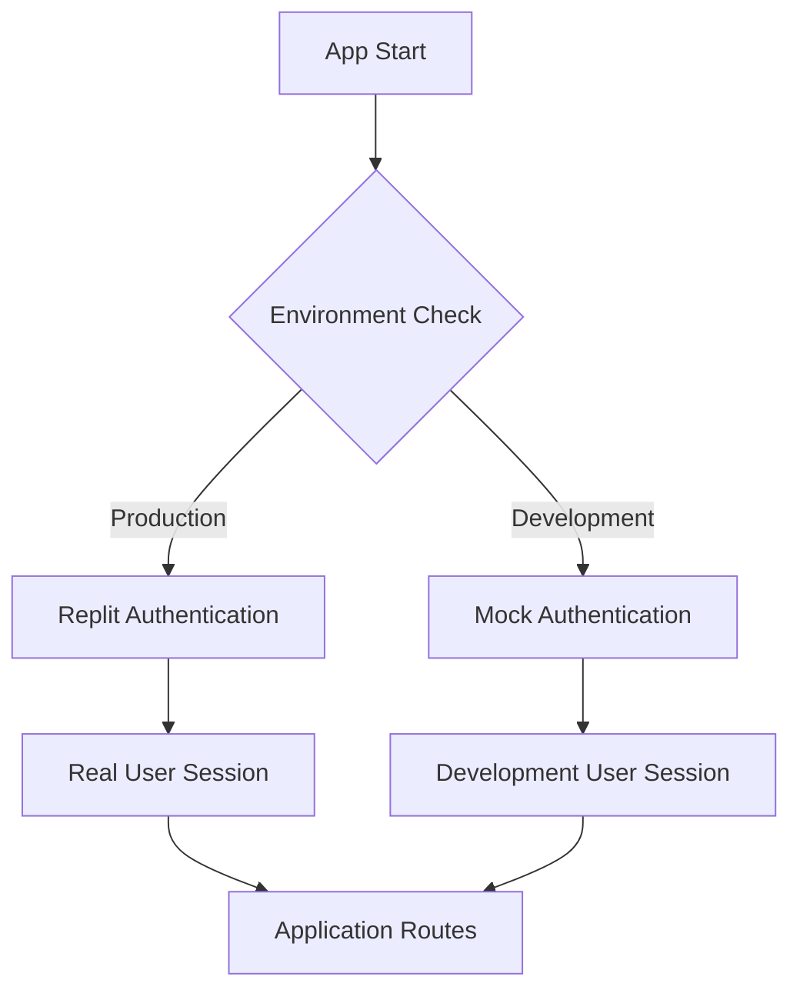

# Authentication Architecture Documentation

## Overview

This document details the dual authentication system implemented for the AI Glossary Pro application to support both local development and production environments.

## Problem Statement

### Original Issue
- **Symptoms**: Blank page, 401 unauthorized errors, "t.map is not a function" JavaScript errors
- **Root Cause**: Application was configured for Replit authentication but running locally without proper credentials
- **Impact**: Complete application failure in local development environment

### Technical Details
```javascript
// Original issue chain
Vite dev server disabled → No React frontend served → Blank page
Replit auth in local dev → 401 errors → Frontend crashes
API returns {success, data} → Frontend expects arrays → "t.map is not a function"
Result: Complete application failure
```

## Solution Architecture

### Dual Authentication System

The application now implements environment-aware authentication:



### Configuration Logic

```javascript
// Feature detection in config.ts
export const features = {
  replitAuthEnabled: !!(config.REPLIT_DOMAINS && config.REPL_ID),
  // ... other features
};

// Route middleware selection
const authMiddleware = features.replitAuthEnabled ? isAuthenticated : mockIsAuthenticated;
const tokenMiddleware = features.replitAuthEnabled ? authenticateToken : mockAuthenticateToken;
```

## Implementation Details

### 1. Mock Authentication System (`server/middleware/dev/mockAuth.ts`)

**Purpose**: Provides authentication bypass for local development

**Key Components**:
```javascript
// Development user profile
const DEV_USER = {
  claims: {
    sub: "dev-user-123",
    email: "dev@example.com",
    name: "Development User"
  }
};

// Mock middleware functions
export const mockIsAuthenticated = (req, res, next) => {
  req.user = DEV_USER;
  req.isAuthenticated = () => true;
  next();
};

export const mockAuthenticateToken = (req, res, next) => {
  // Transform user to expected format
  req.user = { claims: DEV_USER.claims };
  next();
};
```

**Features**:
- Automatic user creation in database
- Mock login/logout endpoints
- Passport.js compatibility
- Development user persistence

### 2. Conditional Middleware Implementation

**Pattern Applied to All Protected Routes**:
```javascript
// In each route file (auth.ts, user.ts, admin.ts)
import { mockIsAuthenticated, mockAuthenticateToken } from "../middleware/dev/mockAuth";
import { features } from "../config";

export function registerRoutes(app: Express): void {
  const authMiddleware = features.replitAuthEnabled ? isAuthenticated : mockIsAuthenticated;
  const tokenMiddleware = features.replitAuthEnabled ? authenticateToken : mockAuthenticateToken;
  
  app.get('/api/protected-route', authMiddleware, tokenMiddleware, handler);
}
```

**Files Modified**:
- `server/routes/auth.ts` - Authentication endpoints
- `server/routes/user.ts` - User-specific routes (favorites, progress)
- `server/routes/admin.ts` - Admin management routes
- `server/routes/index.ts` - Main route registration

### 3. Admin Access Control

**Enhanced Admin Middleware**:
```javascript
export async function requireAdmin(req, res, next): Promise<void> {
  // Development mode bypass
  if (req.user.claims.sub === "dev-user-123") {
    console.log("🔓 Development mode: Granting admin access to dev user");
    next();
    return;
  }
  
  // Production admin check
  const user = await db.select({ isAdmin: users.isAdmin })
    .from(users)
    .where(eq(users.id, req.user.claims.sub));
    
  if (!user.length || !user[0].isAdmin) {
    return res.status(403).json({ message: "Admin privileges required" });
  }
  
  next();
}
```

## Environment Configuration

### Development Environment
```env
# .env for local development
NODE_ENV=development
DATABASE_URL=postgresql://...
SESSION_SECRET=...
# Replit auth vars empty or missing
REPLIT_CLIENT_ID=
REPLIT_CLIENT_SECRET=
```

**Behavior**:
- `features.replitAuthEnabled = false`
- Mock authentication activated
- Development user auto-created
- All admin features accessible

### Production Environment
```env
# .env for production (Replit)
NODE_ENV=production
DATABASE_URL=postgresql://...
SESSION_SECRET=...
REPLIT_DOMAINS=your-repl-domain.replit.app
REPL_ID=your-repl-id
ISSUER_URL=https://replit.com/oidc
```

**Behavior**:
- `features.replitAuthEnabled = true`
- Real Replit authentication
- User sessions from OAuth flow
- Admin access based on database roles

## Operational Procedures

### Local Development Setup

1. **Initial Setup**:
   ```bash
   cd /path/to/project
   npm install
   cp .env.example .env
   # Edit .env with local database credentials
   npm run dev
   ```

2. **Verification**:
   ```bash
   curl http://127.0.0.1:3001/api/auth/user
   # Should return development user data
   ```

3. **Expected Console Output**:
   ```
   ✅ Mock authentication setup complete (development mode)
   🔓 Development user ensured in database: dev@example.com
   🔓 Mock authentication: User logged in as dev@example.com
   ```

### Production Deployment

1. **Environment Setup**:
   ```bash
   # Ensure all Replit auth variables are set
   echo $REPLIT_DOMAINS
   echo $REPL_ID
   ```

2. **Verification**:
   ```bash
   curl https://your-app.replit.app/api/health
   # Check logs for: "✅ Replit authentication setup complete"
   ```

3. **User Creation**:
   - Users created automatically via OAuth flow
   - Admin privileges must be granted manually in database:
   ```sql
   UPDATE users SET is_admin = true WHERE email = 'admin@example.com';
   ```

## Troubleshooting Guide

### Common Issues

#### 1. 401 Errors in Development
**Symptoms**: Still getting unauthorized errors locally

**Diagnosis**:
```bash
# Check environment detection
curl http://127.0.0.1:3001/api/health
# Look for authentication type in logs
```

**Solutions**:
- Verify `NODE_ENV=development` in .env
- Ensure Replit auth vars are empty/missing
- Restart server completely
- Clear browser cookies

#### 2. Mock Auth Not Working
**Symptoms**: Development user not created

**Diagnosis**:
```javascript
// Check storage.upsertUser functionality
// Verify database connectivity
```

**Solutions**:
- Check database connection
- Verify storage.upsertUser method exists
- Run database migrations: `npm run db:push`

#### 3. Frontend Still Crashing
**Symptoms**: "t.map is not a function" persists

**Diagnosis**:
```javascript
// Check API response format
// Verify useAuth hook implementation
```

**Solutions**:
- Hard refresh browser (Cmd+Shift+R)
- Clear browser cache
- Check network tab for API responses
- Verify query client configuration

#### 4. Production Auth Fails
**Symptoms**: OAuth flow not working in production

**Diagnosis**:
- Check Replit auth configuration
- Verify redirect URLs match
- Check environment variables

**Solutions**:
- Update Replit OAuth app settings
- Verify all required env vars are set
- Check domain configuration

### Debug Tools

#### 1. Authentication Status Endpoint
```bash
GET /api/auth/user
# Returns current user or 401
```

#### 2. Health Check Endpoint
```bash
GET /api/health
# Returns system status and configuration
```

#### 3. Feature Flags Endpoint
```bash
GET /api/admin/stats
# Shows feature configuration (admin only)
```

### Monitoring

#### Key Metrics
- Authentication success/failure rates
- User session duration
- API endpoint response times
- Error rates by environment

#### Log Patterns
```javascript
// Successful mock auth
"🔓 Mock authentication: User logged in as dev@example.com"

// Successful production auth
"✅ Replit authentication setup complete"

// Auth failures
"Authentication verification failed"
"Admin privileges required"
```

## Security Considerations

### Development Security
- Mock authentication only in development
- Development user has limited scope (dev-user-123)
- No real user data exposure
- Database isolation recommended

### Production Security
- Real OAuth flow with Replit
- Session-based authentication
- CSRF protection via express-session
- HTTPS enforcement
- Admin role verification

### Best Practices
1. **Never deploy mock auth to production**
2. **Rotate session secrets regularly**
3. **Monitor authentication failures**
4. **Regular security audits of auth flow**
5. **Keep OAuth credentials secure**

## Migration Guide

### Adding New Protected Routes
```javascript
// Pattern for new route files
import { mockIsAuthenticated } from "../middleware/dev/mockAuth";
import { features } from "../config";

export function registerNewRoutes(app: Express): void {
  const authMiddleware = features.replitAuthEnabled ? isAuthenticated : mockIsAuthenticated;
  
  app.get('/api/new-route', authMiddleware, handler);
}
```

### Extending Mock Authentication
```javascript
// To add new development users
const DEV_USERS = {
  admin: { sub: "dev-admin-123", email: "admin@dev.local" },
  user: { sub: "dev-user-123", email: "user@dev.local" }
};

// Environment variable for dev user selection
const selectedUser = process.env.DEV_USER_TYPE || 'admin';
```

## Future Considerations

### Potential Enhancements
1. **Multi-tenant development users**
2. **Development-specific admin panel**
3. **OAuth provider abstraction layer**
4. **Automated testing for both auth modes**
5. **Development user role simulation**

### Technical Debt
1. **TODO: Admin role verification in all admin routes**
2. **TODO: Rate limiting for authentication endpoints**
3. **TODO: Audit logging for admin actions**
4. **TODO: Session cleanup and management**

## Contact Information

For questions about this authentication system:
- **Architecture**: Review this document and implementation files
- **Issues**: Check troubleshooting guide first
- **Changes**: Follow migration guide patterns
- **Security**: Consult security considerations section

Last Updated: June 22, 2025
Version: 2.0.0